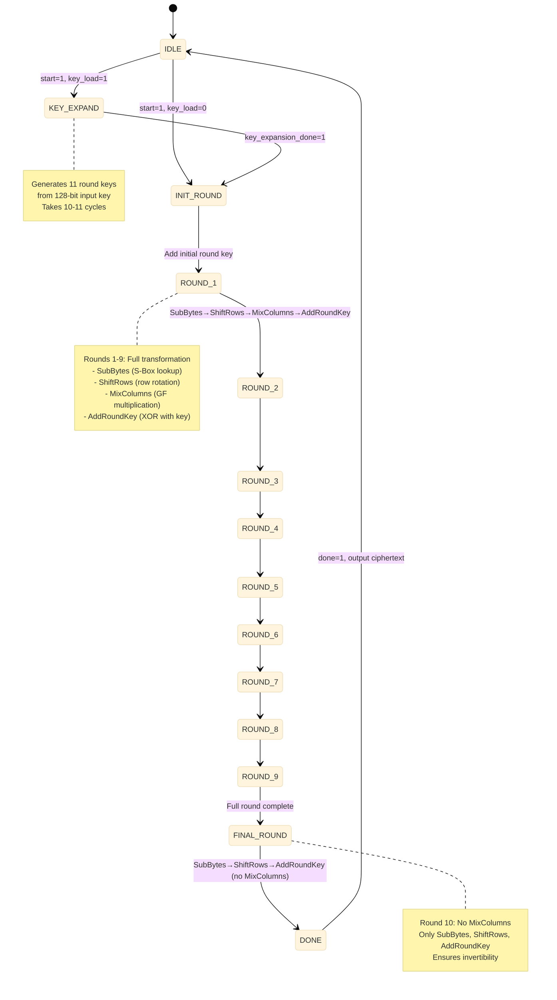

# AES-128 Block Diagrams & Architecture

Comprehensive visual documentation of the AES-128 encryption engine architecture for the Secure UART Peripheral.

---

## Table of Contents

1. [High-Level System Integration](#high-level-system-integration)
2. [AES-128 Core Architecture](#aes-128-core-architecture)
3. [Round Function Components](#round-function-components)
4. [Key Expansion Module](#key-expansion-module)
5. [Encryption/Decryption Data Path](#encryptiondecryption-data-path)
6. [State Machine Diagrams](#state-machine-diagrams)
7. [Timing Diagrams](#timing-diagrams)
8. [Integration with UART](#integration-with-uart)

---

## High-Level System Integration

### Secure UART System Block Diagram

```
┌──────────────────────────────────────────────────────────────────────────┐
│                     Secure UART Peripheral System                        │
│                                                                          │
│  ┌────────────────┐      ┌──────────────────┐      ┌────────────────┐ │
│  │                │      │                  │      │                │ │
│  │   CPU Core     │◄────►│  Register        │◄────►│   UART Core    │ │
│  │   (TinyQV)     │      │  Interface       │      │   (TX/RX)      │ │
│  │                │      │                  │      │                │ │
│  └────────────────┘      └──────────────────┘      └────────────────┘ │
│         ▲                        │                         │           │
│         │                        │                         │           │
│         │                        ▼                         ▼           │
│         │                ┌──────────────────┐      ┌────────────────┐ │
│         │                │                  │      │                │ │
│         │                │  AES-128 Engine  │◄────►│   TX FIFO      │ │
│         │                │  (Encrypt/       │      │   (16 bytes)   │ │
│         │                │   Decrypt)       │      │                │ │
│         │                │                  │      └────────────────┘ │
│         │                └──────────────────┘              │           │
│         │                        │                         │           │
│         │                        ▼                         ▼           │
│         │                ┌──────────────────┐      ┌────────────────┐ │
│         └────────────────│  Key Register    │      │   RX FIFO      │ │
│  Interrupt               │  (128-bit AES    │      │   (16 bytes)   │ │
│                          │   Key Storage)   │      │                │ │
│                          └──────────────────┘      └────────────────┘ │
│                                                            │           │
│                                                            ▼           │
│                                                     ┌────────────────┐ │
│                                                     │  Flow Control  │ │
│                                                     │  (RTS/CTS)     │ │
│                                                     └────────────────┘ │
│                                                            │           │
└────────────────────────────────────────────────────────────┼───────────┘
                                                             │
                                                             ▼
                                                    Serial Line (TX/RX)
```

### Data Flow: Secure Transmission

```
┌──────────┐
│   CPU    │ Writes plaintext byte to TX_DATA register
└────┬─────┘
     │
     ▼
┌─────────────────┐
│  TX FIFO        │ Buffers plaintext bytes
│  [P1][P2][P3].. │
└────┬────────────┘
     │ When 16 bytes accumulated (AES block size)
     ▼
┌─────────────────┐
│  AES Encrypt    │ Encrypts 128-bit block using stored key
│  Plaintext → C  │
└────┬────────────┘
     │ 128-bit ciphertext
     ▼
┌─────────────────┐
│  UART TX        │ Transmits encrypted bytes serially
│  C1→C2→C3→...   │
└────┬────────────┘
     │
     ▼
  Serial Line (encrypted data)
```

### Data Flow: Secure Reception

```
  Serial Line (encrypted data)
     │
     ▼
┌─────────────────┐
│  UART RX        │ Receives encrypted bytes serially
│  C1→C2→C3→...   │
└────┬────────────┘
     │
     ▼
┌─────────────────┐
│  RX FIFO        │ Buffers ciphertext bytes
│  [C1][C2][C3].. │
└────┬────────────┘
     │ When 16 bytes accumulated (AES block size)
     ▼
┌─────────────────┐
│  AES Decrypt    │ Decrypts 128-bit block using stored key
│  Ciphertext → P │
└────┬────────────┘
     │ 128-bit plaintext
     ▼
┌─────────────────┐
│ Register Iface  │ CPU reads plaintext from RX_DATA
└────┬────────────┘
     │
     ▼
┌──────────┐
│   CPU    │ Receives plaintext byte
└──────────┘
```

---

## AES-128 Core Architecture

### Top-Level AES Engine

```
                        AES-128 Encryption/Decryption Engine
┌────────────────────────────────────────────────────────────────────────┐
│                                                                        │
│  Inputs:                          Control:                            │
│  ┌───────────────┐               ┌──────────────┐                    │
│  │ plaintext[127:0]              │ start        │                    │
│  │ or                            │ mode (enc/dec)│                    │
│  │ ciphertext[127:0]             │ key_load     │                    │
│  └──────┬────────┘               └──────┬───────┘                    │
│         │                                │                            │
│         │                                │                            │
│  ┌──────▼────────────────────────────────▼─────────────────┐        │
│  │                  State Register                          │        │
│  │           (128-bit current state)                        │        │
│  │                                                           │        │
│  │   ┌───┬───┬───┬───┐                                     │        │
│  │   │S00│S01│S02│S03│  ◄── 4×4 byte matrix                 │        │
│  │   ├───┼───┼───┼───┤                                     │        │
│  │   │S10│S11│S12│S13│                                     │        │
│  │   ├───┼───┼───┼───┤                                     │        │
│  │   │S20│S21│S22│S23│                                     │        │
│  │   ├───┼───┼───┼───┤                                     │        │
│  │   │S30│S31│S32│S33│                                     │        │
│  │   └───┴───┴───┴───┘                                     │        │
│  └──────┬────────────────────────────────────────────────┬─┘        │
│         │                                                │          │
│         ▼                                                │          │
│  ┌──────────────────────────────────────────────────┐   │          │
│  │           Round Function Pipeline                 │   │          │
│  │                                                    │   │          │
│  │  1. SubBytes    ─┬─► S-Box Substitution          │   │          │
│  │                  │                                 │   │          │
│  │  2. ShiftRows   ─┤─► Row Rotation                 │   │          │
│  │                  │                                 │   │          │
│  │  3. MixColumns  ─┤─► Column Mixing                │   │          │
│  │    (skip last)   │                                 │   │          │
│  │                  │                                 │   │          │
│  │  4. AddRoundKey ─┴─► XOR with Round Key           │   │          │
│  │                                                    │   │          │
│  └──────┬─────────────────────────────────────────┬──┘   │          │
│         │                                         │      │          │
│         │                                         │      │          │
│  ┌──────▼─────────────────────────────────────────▼──┐   │          │
│  │         Key Expansion Module                      │   │          │
│  │                                                    │   │          │
│  │  Input: 128-bit key                               │   │          │
│  │  Output: 11 round keys (RK0-RK10)                │   │          │
│  │                                                    │   │          │
│  │  RK0  ─► Initial key (used in AddRoundKey #0)    │   │          │
│  │  RK1  ─► Round 1 key                              │   │          │
│  │  ...                                               │   │          │
│  │  RK10 ─► Round 10 key (final round)              │   │          │
│  │                                                    │   │          │
│  └────────────────────────────────────────────────────┘   │          │
│                                                            │          │
│  ┌────────────────────────────────────────────────────┐   │          │
│  │         Round Counter & Control FSM                │   │          │
│  │                                                     │   │          │
│  │  States: IDLE → ROUND1-9 → ROUND10 → DONE         │   │          │
│  │          (10 rounds total for AES-128)             │   │          │
│  │                                                     │   │          │
│  └────────────────────────────────────────────────────┘   │          │
│                                                            │          │
│  Output:                                                   │          │
│  ┌──────────────────────────────────────────────────┐     │          │
│  │ ciphertext[127:0]  (if encrypting)               │◄────┘          │
│  │ or                                                │                │
│  │ plaintext[127:0]   (if decrypting)               │                │
│  │                                                   │                │
│  │ done              ─► Completion flag              │                │
│  │ busy              ─► Operation in progress        │                │
│  └───────────────────────────────────────────────────┘                │
│                                                                        │
└────────────────────────────────────────────────────────────────────────┘
```

---

## Round Function Components

### SubBytes Transformation

```
SubBytes: S-Box Lookup for Each Byte

Input State (16 bytes):
┌───┬───┬───┬───┐
│ A │ B │ C │ D │
├───┼───┼───┼───┤
│ E │ F │ G │ H │
├───┼───┼───┼───┤
│ I │ J │ K │ L │
├───┼───┼───┼───┤
│ M │ N │ O │ P │
└───┴───┴───┴───┘
      │
      ▼ (S-Box substitution for each byte)
      │
┌─────────────────────────────────────┐
│   Rijndael S-Box (16×16 lookup)    │
│                                     │
│   Input byte → Output byte          │
│   0x00 → 0x63                       │
│   0x01 → 0x7C                       │
│   ...                                │
│   0xFF → 0x16                       │
└─────────────────────────────────────┘
      │
      ▼
Output State (16 bytes):
┌───┬───┬───┬───┐
│A' │B' │C' │D' │  (Each byte substituted)
├───┼───┼───┼───┤
│E' │F' │G' │H' │
├───┼───┼───┼───┤
│I' │J' │K' │L' │
├───┼───┼───┼───┤
│M' │N' │O' │P' │
└───┴───┴───┴───┘

Implementation:
- 16 parallel S-Box lookups (one per byte)
- S-Box can be ROM (256×8) or combinational logic
- Encryption and decryption use different S-Boxes
```

### ShiftRows Transformation

```
ShiftRows: Cyclic Row Rotation

Input State:
┌───┬───┬───┬───┐
│S00│S01│S02│S03│  Row 0: No shift
├───┼───┼───┼───┤
│S10│S11│S12│S13│  Row 1: Left shift by 1
├───┼───┼───┼───┤
│S20│S21│S22│S23│  Row 2: Left shift by 2
├───┼───┼───┼───┤
│S30│S31│S32│S33│  Row 3: Left shift by 3
└───┴───┴───┴───┘
      │
      ▼ (Rotate rows)
      │
Output State:
┌───┬───┬───┬───┐
│S00│S01│S02│S03│  Row 0: [S00 S01 S02 S03] → [S00 S01 S02 S03]
├───┼───┼───┼───┤
│S11│S12│S13│S10│  Row 1: [S10 S11 S12 S13] → [S11 S12 S13 S10]
├───┼───┼───┼───┤
│S22│S23│S20│S21│  Row 2: [S20 S21 S22 S23] → [S22 S23 S20 S21]
├───┼───┼───┼───┤
│S33│S30│S31│S32│  Row 3: [S30 S31 S32 S33] → [S33 S30 S31 S32]
└───┴───┴───┴───┘

Implementation:
- Pure wiring (no gates!)
- Just byte position reassignment
- Decryption: shift right instead of left
```

### MixColumns Transformation

```
MixColumns: Matrix Multiplication in GF(2^8)

Each column multiplied by fixed matrix:

Column:        Matrix:         Result:
┌───┐         ┌───────────┐   ┌───┐
│S0j│         │02 03 01 01│   │R0j│
│S1j│    ×    │01 02 03 01│ = │R1j│
│S2j│         │01 01 02 03│   │R2j│
│S3j│         │03 01 01 02│   │R3j│
└───┘         └───────────┘   └───┘

Example for column j:
R0j = (02•S0j) ⊕ (03•S1j) ⊕ (01•S2j) ⊕ (01•S3j)
R1j = (01•S0j) ⊕ (02•S1j) ⊕ (03•S2j) ⊕ (01•S3j)
R2j = (01•S0j) ⊕ (01•S1j) ⊕ (02•S2j) ⊕ (03•S3j)
R3j = (03•S0j) ⊕ (01•S1j) ⊕ (01•S2j) ⊕ (02•S3j)

Where:
• = Galois Field multiplication (GF(2^8))
⊕ = XOR

Galois Field Multiplication:
02•x = (x << 1) ⊕ (0x1B if x[7]=1 else 0)  [xtime operation]
03•x = (02•x) ⊕ x

Implementation:
- 4 parallel column mixers
- Each column mixer: combinational logic
- Skipped in final round (round 10)
```

### AddRoundKey Transformation

```
AddRoundKey: XOR with Round Key

State:                Round Key:          Result:
┌───┬───┬───┬───┐    ┌───┬───┬───┬───┐   ┌───┬───┬───┬───┐
│S00│S01│S02│S03│    │K00│K01│K02│K03│   │R00│R01│R02│R03│
├───┼───┼───┼───┤ ⊕  ├───┼───┼───┼───┤ = ├───┼───┼───┼───┤
│S10│S11│S12│S13│    │K10│K11│K12│K13│   │R10│R11│R12│R13│
├───┼───┼───┼───┤    ├───┼───┼───┼───┤   ├───┼───┼───┼───┤
│S20│S21│S22│S23│    │K20│K21│K22│K23│   │R20│R21│R22│R23│
├───┼───┼───┼───┤    ├───┼───┼───┼───┤   ├───┼───┼───┼───┤
│S30│S31│S32│S33│    │K30│K31│K32│K33│   │R30│R31│R32│R33│
└───┴───┴───┴───┘    └───┴───┴───┴───┘   └───┴───┴───┴───┘

Rij = Sij ⊕ Kij  (simple XOR for all 16 bytes)

Implementation:
- 16 parallel 8-bit XOR gates
- Simplest transformation in AES
- Same operation for encryption and decryption (with different keys)
```

---

## Key Expansion Module

### Key Schedule Architecture

```
Key Expansion: 128-bit Key → 11 Round Keys (1408 bits total)

Initial Key (128 bits):
┌──────┬──────┬──────┬──────┐
│  W0  │  W1  │  W2  │  W3  │  (4 words, 32 bits each)
└──┬───┴──┬───┴──┬───┴──┬───┘
   │      │      │      │
   │      │      │      │
   ▼      ▼      ▼      ▼
┌──────────────────────────────────────────┐
│        Round Constant Addition           │
│        RotWord + SubWord                 │
│        XOR Operations                    │
└──────────────────────────────────────────┘
   │      │      │      │
   ▼      ▼      ▼      ▼
Round Key 1 (RK1):
┌──────┬──────┬──────┬──────┐
│  W4  │  W5  │  W6  │  W7  │
└──────┴──────┴──────┴──────┘
   │      │      │      │
   ▼      ▼      ▼      ▼
  (Repeat for rounds 2-10)
   │
   ▼
Round Key 10 (RK10):
┌──────┬──────┬──────┬──────┐
│  W40 │  W41 │  W42 │  W43 │
└──────┴──────┴──────┴──────┘

Total: 44 words (11 round keys × 4 words)
```

### Word Generation Logic

```
Generating Word W[i]:

If i mod 4 = 0 (first word of round):
┌──────────────────────────────────────────┐
│  temp = W[i-1]                           │
│  temp = RotWord(temp)    ◄─ Rotate left  │
│  temp = SubWord(temp)    ◄─ S-Box on each byte
│  temp = temp ⊕ Rcon[i/4] ◄─ Add round constant
│  W[i] = W[i-4] ⊕ temp                    │
└──────────────────────────────────────────┘

Else:
┌──────────────────────────────────────────┐
│  W[i] = W[i-4] ⊕ W[i-1]                  │
└──────────────────────────────────────────┘

Round Constants (Rcon):
Rcon[1]  = 0x01000000
Rcon[2]  = 0x02000000
Rcon[3]  = 0x04000000
Rcon[4]  = 0x08000000
Rcon[5]  = 0x10000000
Rcon[6]  = 0x20000000
Rcon[7]  = 0x40000000
Rcon[8]  = 0x80000000
Rcon[9]  = 0x1B000000
Rcon[10] = 0x36000000

RotWord Example:
[A0, A1, A2, A3] → [A1, A2, A3, A0]

SubWord Example:
[A0, A1, A2, A3] → [S-Box(A0), S-Box(A1), S-Box(A2), S-Box(A3)]
```

---

## Encryption/Decryption Data Path

### Complete Encryption Flow

```
        ┌─────────────────┐
        │  Plaintext      │
        │  (128 bits)     │
        └────────┬────────┘
                 │
                 ▼
        ┌─────────────────┐
        │  AddRoundKey(0) │◄──── Initial Key (RK0)
        │  (Initial XOR)  │
        └────────┬────────┘
                 │
      ╔══════════▼════════════╗
      ║   Rounds 1-9          ║
      ║                       ║
      ║  ┌─────────────────┐  ║
      ║  │   SubBytes      │  ║
      ║  └────────┬────────┘  ║
      ║           ▼            ║
      ║  ┌─────────────────┐  ║
      ║  │   ShiftRows     │  ║
      ║  └────────┬────────┘  ║
      ║           ▼            ║
      ║  ┌─────────────────┐  ║
      ║  │   MixColumns    │  ║
      ║  └────────┬────────┘  ║
      ║           ▼            ║
      ║  ┌─────────────────┐  ║
      ║  │  AddRoundKey(i) │◄─╢─── Round Keys RK1-RK9
      ║  └────────┬────────┘  ║
      ║           │            ║
      ╚═══════════╪════════════╝
                  │ (Repeat 9 times)
                  ▼
      ╔════════════════════════╗
      ║   Final Round (10)     ║
      ║                        ║
      ║  ┌─────────────────┐   ║
      ║  │   SubBytes      │   ║
      ║  └────────┬────────┘   ║
      ║           ▼             ║
      ║  ┌─────────────────┐   ║
      ║  │   ShiftRows     │   ║
      ║  └────────┬────────┘   ║
      ║           ▼             ║
      ║  ┌─────────────────┐   ║
      ║  │ AddRoundKey(10) │◄──╢─── Final Key (RK10)
      ║  │ (No MixColumns) │   ║
      ║  └────────┬────────┘   ║
      ╚═══════════╪════════════╝
                  │
                  ▼
        ┌─────────────────┐
        │  Ciphertext     │
        │  (128 bits)     │
        └─────────────────┘

Total: 10 rounds
- Rounds 1-9: Full transformation (4 steps)
- Round 10: No MixColumns (3 steps)
```

### Complete Decryption Flow

```
        ┌─────────────────┐
        │  Ciphertext     │
        │  (128 bits)     │
        └────────┬────────┘
                 │
                 ▼
        ┌─────────────────┐
        │AddRoundKey(10)  │◄──── Final Key (RK10)
        │  (Initial XOR)  │
        └────────┬────────┘
                 │
      ╔══════════▼════════════╗
      ║   Rounds 9-1          ║
      ║   (Reverse order)     ║
      ║                       ║
      ║  ┌─────────────────┐  ║
      ║  │ InvShiftRows    │  ║
      ║  └────────┬────────┘  ║
      ║           ▼            ║
      ║  ┌─────────────────┐  ║
      ║  │  InvSubBytes    │  ║
      ║  └────────┬────────┘  ║
      ║           ▼            ║
      ║  ┌─────────────────┐  ║
      ║  │  AddRoundKey(i) │◄─╢─── Round Keys RK9-RK1
      ║  └────────┬────────┘  ║
      ║           ▼            ║
      ║  ┌─────────────────┐  ║
      ║  │ InvMixColumns   │  ║
      ║  └────────┬────────┘  ║
      ║           │            ║
      ╚═══════════╪════════════╝
                  │ (Repeat 9 times)
                  ▼
      ╔════════════════════════╗
      ║   Final Round (0)      ║
      ║                        ║
      ║  ┌─────────────────┐   ║
      ║  │ InvShiftRows    │   ║
      ║  └────────┬────────┘   ║
      ║           ▼             ║
      ║  ┌─────────────────┐   ║
      ║  │  InvSubBytes    │   ║
      ║  └────────┬────────┘   ║
      ║           ▼             ║
      ║  ┌─────────────────┐   ║
      ║  │ AddRoundKey(0)  │◄──╢─── Initial Key (RK0)
      ║  └────────┬────────┘   ║
      ╚═══════════╪════════════╝
                  │
                  ▼
        ┌─────────────────┐
        │  Plaintext      │
        │  (128 bits)     │
        └─────────────────┘

Note: Decryption uses inverse operations
- InvSubBytes: Inverse S-Box
- InvShiftRows: Right shifts
- InvMixColumns: Inverse matrix multiplication
```

---

## State Machine Diagrams

### AES Encryption FSM



### Practical AES Controller FSM (Simplified)

```
                ┌──────────────┐
           ┌────│     IDLE     │◄────────────┐
           │    └──────────────┘             │
           │           │                      │
    start=1│           │key_load=1           │done=1
           │           ▼                      │
           │    ┌──────────────┐             │
           │    │ KEY_EXPAND   │─────────────┤
           │    └──────────────┘             │
           │                                  │
           │                                  │
           ▼                                  │
    ┌──────────────┐                         │
    │  LOAD_DATA   │ ◄─ Load 128-bit input   │
    └──────┬───────┘                         │
           │                                  │
           │ data_ready=1                    │
           ▼                                  │
    ┌──────────────┐                         │
    │  INIT_XOR    │ ◄─ AddRoundKey(RK0)    │
    └──────┬───────┘                         │
           │                                  │
           ▼                                  │
    ┌──────────────┐                         │
    │   ROUND_OP   │ ◄─ Execute round function│
    └──────┬───────┘                         │
           │     ▲                            │
           │     │                            │
           │     └─── round_count < 9         │
           │                                  │
           │ round_count = 9                 │
           ▼                                  │
    ┌──────────────┐                         │
    │  FINAL_ROUND │ ◄─ Round 10 (no MixCol) │
    └──────┬───────┘                         │
           │                                  │
           │                                  │
           ▼                                  │
    ┌──────────────┐                         │
    │     DONE     │─────────────────────────┘
    └──────────────┘

State Timing:
- IDLE: Wait for start signal
- KEY_EXPAND: 10-11 cycles (generates all round keys)
- LOAD_DATA: 1 cycle (latch input)
- INIT_XOR: 1 cycle (initial AddRoundKey)
- ROUND_OP: 1 cycle per round × 9 = 9 cycles
- FINAL_ROUND: 1 cycle
- DONE: 1 cycle (assert done flag)

Total: ~23-24 cycles for complete encryption
```

---

## Timing Diagrams

### AES Encryption Timing (Single Block)

```
Clock Cycle:  0    1    2  ...  11   12   13 ...  21   22   23   24
             ─┴────┴────┴───────┴────┴────┴───────┴────┴────┴────┴────

start        ────┐                                                 ┌────
                 └─────────────────────────────────────────────────┘

key_load     ────┐
                 └──────┐
                        └───────────────────────────────────────────────

state        IDLE  │KEY_EXP │LD │I_X│R1 │R2 │...│R9 │R10│DONE│IDLE
                   └────────┴───┴───┴───┴───┴───┴───┴───┴────┴────────

busy         ─────────┐                                         ┌──────
                      └─────────────────────────────────────────┘

done         ──────────────────────────────────────────────────┐ ┌─────
                                                                └─┘

plaintext    ════════════════╬════════════════════════════════════════
             (input)               (latched at cycle 12)

ciphertext   ═══════════════════════════════════════════════════╬══════
                                                       (valid)  │

Breakdown:
- Cycles 0-11:  Key expansion (if key_load=1)
- Cycle  12:    Load plaintext data
- Cycle  13:    Initial AddRoundKey (RK0)
- Cycles 14-22: Rounds 1-9 (1 cycle each)
- Cycle  23:    Final Round (Round 10)
- Cycle  24:    Assert done, ciphertext valid
```

### Pipelined vs Iterative AES

```
Iterative (Our Implementation):
┌────────────────────────────────────────────────────────────┐
│  Block 1: │IDLE│KEY│LD│IX│R1│R2│R3│R4│R5│R6│R7│R8│R9│RF│DN││
│  Block 2:                 │IDLE│KEY│LD│IX│R1│R2│R3│R4│R5│R6│...
└────────────────────────────────────────────────────────────┘
Latency: ~24 cycles/block
Throughput: 1 block every ~24 cycles
Area: Small (1 round logic reused)

Pipelined (Advanced, not implemented):
┌────────────────────────────────────────────────────────────┐
│  Block 1: │IX│R1│R2│R3│R4│R5│R6│R7│R8│R9│RF│
│  Block 2:    │IX│R1│R2│R3│R4│R5│R6│R7│R8│R9│RF│
│  Block 3:       │IX│R1│R2│R3│R4│R5│R6│R7│R8│R9│RF│
└────────────────────────────────────────────────────────────┘
Latency: ~11 cycles/block (first block)
Throughput: 1 block every cycle (after pipeline fill)
Area: Large (11× round logic)

Our Choice: Iterative
- Better area efficiency (~10× smaller)
- Adequate throughput for UART speeds
- Simpler control logic
```

---

## Integration with UART

### Secure UART TX Path with AES

```
CPU writes byte to TX_DATA register
                │
                ▼
        ┌───────────────┐
        │  TX FIFO      │
        │  (16 bytes)   │
        │               │
        │ [B0][B1]...   │
        │     [B15]     │
        └───────┬───────┘
                │
                │ FIFO count = 16?
                ▼
        ┌───────────────┐
        │  MUX: Select  │
        │  16 bytes     │
        │  (128 bits)   │
        └───────┬───────┘
                │
                ▼
        ┌───────────────┐     ┌──────────────┐
        │  AES Encrypt  │◄────│  Key Register│
        │               │     │  (128-bit)   │
        │  Plaintext    │     └──────────────┘
        │     ↓         │
        │  Ciphertext   │
        └───────┬───────┘
                │
                │ 128-bit encrypted block
                ▼
        ┌───────────────┐
        │  Byte Splitter│ ◄─ Split into 16 bytes
        │               │
        │ C0,C1,...,C15 │
        └───────┬───────┘
                │
                ▼
        ┌───────────────┐
        │  UART TX      │ ◄─ Send bytes serially
        │               │    Start→D0→D1→...→D7→Stop
        │               │    (for each encrypted byte)
        └───────┬───────┘
                │
                ▼
        Serial Line (encrypted data stream)
```

### Secure UART RX Path with AES

```
Serial Line (encrypted data stream)
                │
                ▼
        ┌───────────────┐
        │  UART RX      │ ◄─ Receive bytes serially
        │               │    Detect Start→Sample bits→Stop
        │               │    (reconstructs byte)
        └───────┬───────┘
                │
                ▼
        ┌───────────────┐
        │  RX FIFO      │
        │  (16 bytes)   │
        │               │
        │ [C0][C1]...   │
        │     [C15]     │
        └───────┬───────┘
                │
                │ FIFO count = 16?
                ▼
        ┌───────────────┐
        │  MUX: Select  │
        │  16 bytes     │
        │  (128 bits)   │
        └───────┬───────┘
                │
                ▼
        ┌───────────────┐     ┌──────────────┐
        │  AES Decrypt  │◄────│  Key Register│
        │               │     │  (128-bit)   │
        │  Ciphertext   │     │  (same key)  │
        │     ↓         │     └──────────────┘
        │  Plaintext    │
        └───────┬───────┘
                │
                │ 128-bit decrypted block
                ▼
        ┌───────────────┐
        │  Byte Buffer  │ ◄─ Split into 16 bytes
        │               │
        │ P0,P1,...,P15 │
        └───────┬───────┘
                │
                ▼
        ┌───────────────┐
        │  Register     │ ◄─ CPU reads RX_DATA
        │  Interface    │    (one byte at a time)
        └───────┬───────┘
                │
                ▼
        CPU receives plaintext byte
```

### Register Map for Secure UART

```
Address Map (32-bit bus):

0x00: CTRL           [R/W]  Control register
                            [3:0] BAUD_SEL (baud rate)
                            [4]   TX_EN (enable TX)
                            [5]   RX_EN (enable RX)
                            [6]   AES_EN (enable encryption)
                            [7]   Reserved

0x04: STATUS         [R]    Status register
                            [0]   TX_BUSY
                            [1]   RX_READY
                            [2]   RX_ERROR
                            [3]   AES_BUSY
                            [7:4] TX_FIFO_COUNT[3:0]

0x08: TX_DATA        [W]    Transmit data (8-bit)
                            Write byte to TX FIFO

0x0C: RX_DATA        [R]    Receive data (8-bit)
                            Read byte from RX FIFO

0x10: INT_EN         [R/W]  Interrupt enable
                            [0]   TX_DONE_INT_EN
                            [1]   RX_READY_INT_EN
                            [2]   AES_DONE_INT_EN

0x14: INT_CLR        [W]    Interrupt clear
                            [0]   CLR_TX_DONE
                            [1]   CLR_RX_READY
                            [2]   CLR_AES_DONE

0x18: AES_KEY_0      [W]    AES Key bits [31:0]
0x1C: AES_KEY_1      [W]    AES Key bits [63:32]
0x20: AES_KEY_2      [W]    AES Key bits [95:64]
0x24: AES_KEY_3      [W]    AES Key bits [127:96]

0x28: AES_CTRL       [R/W]  AES control
                            [0]   KEY_LOAD (load new key)
                            [1]   Reserved

Usage Flow:
1. Write 128-bit key to AES_KEY_0-3
2. Set KEY_LOAD=1 in AES_CTRL
3. Enable AES_EN=1 in CTRL
4. Write plaintext bytes to TX_DATA
5. When 16 bytes accumulated, auto-encrypt and transmit
6. On RX, when 16 encrypted bytes received, auto-decrypt
7. Read plaintext from RX_DATA
```

---

## Summary

This document provides comprehensive visual representations of the AES-128 encryption engine:

**Key Components:**

-   AES-128 core with round function pipeline
-   Key expansion module (generates 11 round keys)
-   Integration with UART TX/RX data paths
-   FIFO buffers for block accumulation
-   Register interface for key management

**Characteristics:**

-   **Iterative architecture**: Reuses one round function 10 times
-   **Area-efficient**: Suitable for FPGA/ASIC constraints
-   **Latency**: ~24 clock cycles per 128-bit block
-   **Throughput**: Adequate for UART serial speeds (115200 bps)

**Security:**

-   Standard AES-128 (NIST FIPS 197)
-   10-round encryption/decryption
-   Symmetric key cryptography
-   128-bit block size matches 16-byte FIFO depth

For detailed algorithm explanations, see [AES_FUNDAMENTALS.md](AES_FUNDAMENTALS.md).

---

_Last Updated: January 21, 2026_
