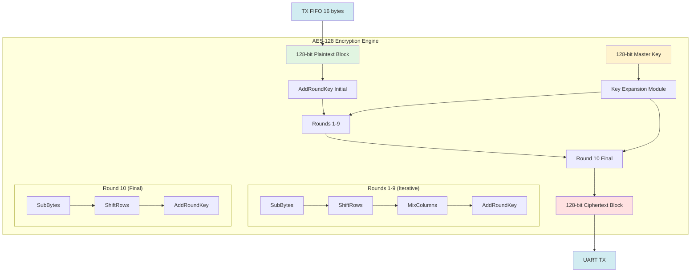
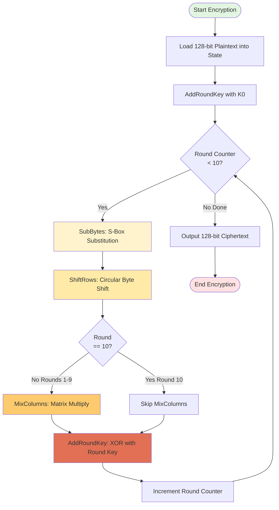
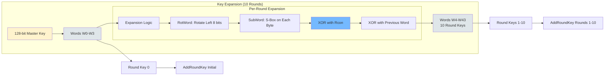
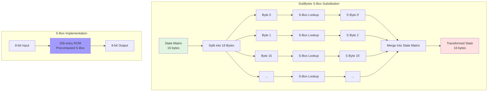
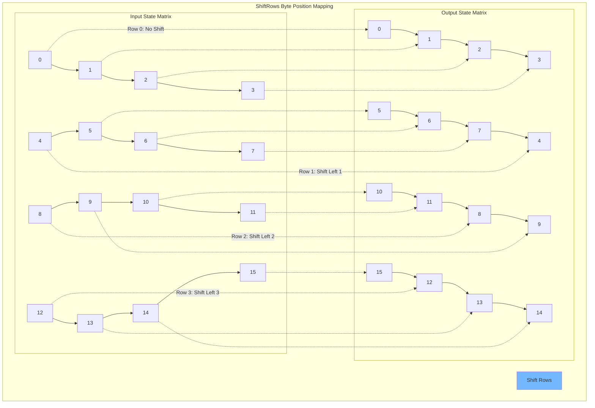
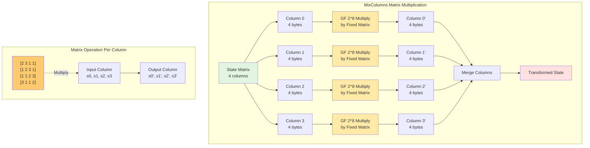
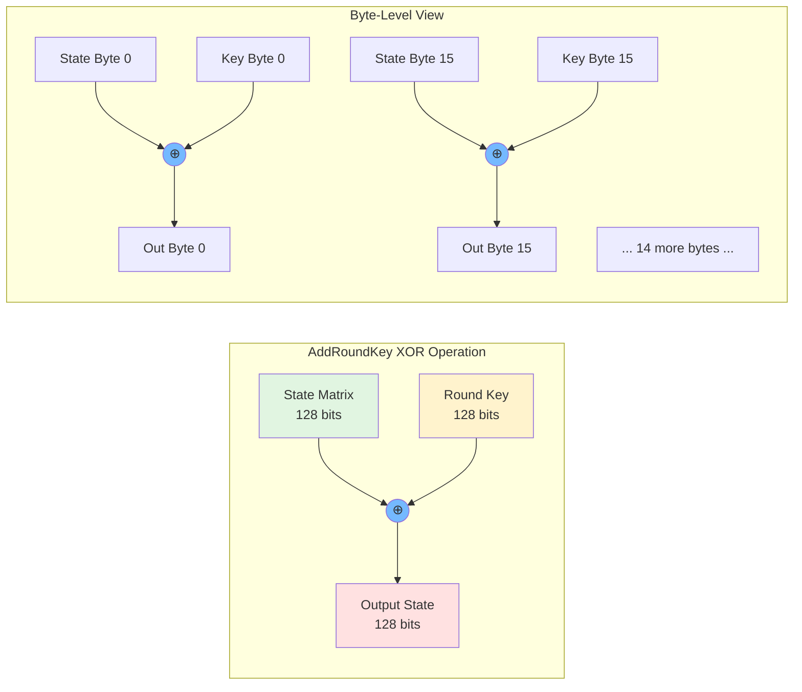
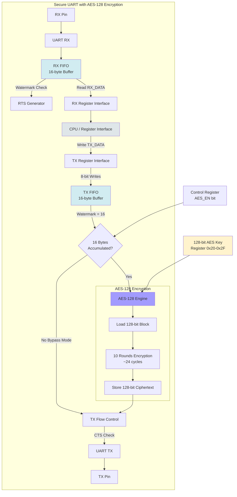
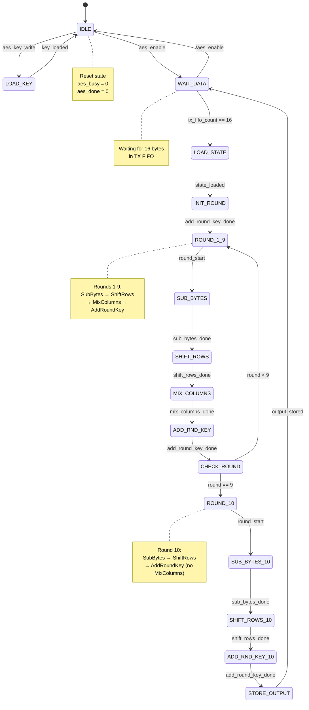

# AES-128 Mermaid Diagrams

Interactive block diagrams for the AES-128 encryption engine implementation.

## Table of Contents
1. [AES-128 Top-Level Architecture](#1-aes-128-top-level-architecture)
2. [Encryption Round Function Flowchart](#2-encryption-round-function-flowchart)
3. [Key Expansion Block Diagram](#3-key-expansion-block-diagram)
4. [SubBytes Transformation](#4-subbytes-transformation)
5. [ShiftRows Transformation](#5-shiftrows-transformation)
6. [MixColumns Transformation](#6-mixcolumns-transformation)
7. [AddRoundKey Operation](#7-addroundkey-operation)
8. [Integration with UART TX/RX](#8-integration-with-uart-txrx)
9. [Control FSM State Machine](#9-control-fsm-state-machine)

---

## 1. AES-128 Top-Level Architecture

**Notes**:
- Total: 10 rounds (9 full rounds + 1 final round without MixColumns)
- Each round operates on 128-bit (16-byte) state matrix
- Key expansion generates 11 round keys (initial + 10 rounds)
- Iterative architecture reuses hardware for all rounds

---

## 2. Encryption Round Function Flowchart

**Key Points**:
- 10 total rounds executed
- Round 10 omits MixColumns (AES-128 standard)
- Each transformation modifies state in-place
- Round counter increments 0→10

---

## 3. Key Expansion Block Diagram

**Key Expansion Details**:
- Master key → 4 words (W0, W1, W2, W3) = 128 bits
- Generate 40 more words (W4-W43) for 10 rounds
- Each round key = 4 words = 128 bits
- Total: 11 round keys (176 bytes stored)

**Rcon Values** (Round Constants):
- Round 1: 0x01, Round 2: 0x02, Round 3: 0x04, Round 4: 0x08
- Round 5: 0x10, Round 6: 0x20, Round 7: 0x40, Round 8: 0x80
- Round 9: 0x1B, Round 10: 0x36

---

## 4. SubBytes Transformation

**S-Box Properties**:
- Non-linear transformation (confusion)
- Implemented as 256-byte lookup table (ROM)
- Same S-Box used for all 16 bytes
- Combinational logic: 1 cycle latency
- Area: ~512 cells (256×8-bit entries)

---

## 5. ShiftRows Transformation

**ShiftRows Operation**:
- Row 0: No shift
- Row 1: Circular left shift by 1 byte
- Row 2: Circular left shift by 2 bytes
- Row 3: Circular left shift by 3 bytes
- Pure combinational logic (wire routing only)
- Zero area cost (just wire connections)

---

## 6. MixColumns Transformation

**MixColumns Details**:
- Operates independently on each of 4 columns
- Galois Field GF(2^8) arithmetic
- Fixed transformation matrix (invertible)
- Each output byte = XOR of 4 multiplications
- Area: ~400 cells (xtime operations + XOR trees)

**GF(2^8) Multiplication**:
- `{02} • x` = xtime(x) = left shift with conditional XOR 0x1B
- `{03} • x` = xtime(x) ⊕ x

---

## 7. AddRoundKey Operation

**AddRoundKey Properties**:
- Simple bitwise XOR: `state[i] = state[i] ⊕ roundKey[i]`
- Performs 16 byte-wise XORs in parallel
- Combinational logic: ~32 cells (16×2-input XOR)
- Used at start (round 0) and after every round (rounds 1-10)
- Provides key-dependent transformation

---

## 8. Integration with UART TX/RX

**Integration Flow**:
1. CPU writes 16 bytes to TX_DATA register
2. Bytes accumulate in TX FIFO
3. When FIFO has 16 bytes, trigger AES encryption (if enabled)
4. AES encrypts 128-bit block (~24 cycles)
5. Ciphertext feeds to UART TX with flow control
6. RX path has FIFO with RTS generation (decryption future)

**Control Registers**:
- `AES_KEY[0:15]` (0x20-0x2F): 128-bit encryption key
- `AES_CTRL` (0x30): Enable/disable encryption
- `AES_STATUS` (0x31): Busy/done flags

---

## 9. Control FSM State Machine

**FSM States**:
- **IDLE**: Waiting for key load or data
- **LOAD_KEY**: Loading 128-bit master key
- **WAIT_DATA**: Monitoring TX FIFO for 16 bytes
- **LOAD_STATE**: Transfer FIFO → state matrix
- **INIT_ROUND**: AddRoundKey with K0
- **ROUND_1_9**: Execute rounds 1-9 (with MixColumns)
- **SUB_BYTES**: S-Box substitution (1-2 cycles)
- **SHIFT_ROWS**: Row shifting (combinational)
- **MIX_COLUMNS**: Column mixing (1-2 cycles)
- **ADD_RND_KEY**: XOR round key (combinational)
- **CHECK_ROUND**: Test round counter
- **ROUND_10**: Execute final round (no MixColumns)
- **STORE_OUTPUT**: Transfer ciphertext to TX path
- **Output**: Return to WAIT_DATA for next block

**Control Signals**:
- `aes_enable`: Master enable
- `aes_busy`: Encryption in progress
- `aes_done`: Block complete (1-cycle pulse)
- `round_counter`: 0-10 round tracking

---

## Implementation Notes

### Hardware Architecture Choices

1. **Iterative Design**: Single round hardware reused 10 times
   - Pro: Smaller area (~2000 cells vs ~8000 for pipelined)
   - Con: Lower throughput (24 cycles vs 1 cycle per block)
   - Justification: Area-constrained design, moderate throughput OK

2. **S-Box Implementation**: 256-entry ROM (combinational lookup)
   - Pro: Fast (1 cycle), simple
   - Con: Larger than composite field (512 cells vs ~300)
   - Justification: Speed prioritized over area

3. **Key Expansion**: Pre-compute and store all round keys
   - Pro: Faster encryption (no key schedule overhead)
   - Con: More storage (176 bytes for 11 round keys)
   - Alternative: On-the-fly expansion (saves storage, adds ~2 cycles/round)

4. **MixColumns**: Combinational xtime logic
   - Pro: No clock cycles added
   - Con: ~400 cells for Galois field multipliers
   - Justification: Critical path acceptable

### Timing Budget

Estimated cycle counts per operation:
- **AddRoundKey**: Combinational (part of FSM state)
- **SubBytes**: 1 cycle (ROM lookup)
- **ShiftRows**: Combinational (wire routing)
- **MixColumns**: 1 cycle (if pipelined) or combinational
- **Round overhead**: 1 cycle (state transitions)

**Total per round**: ~2-3 cycles
**Total for 10 rounds**: ~24 cycles
**Plus load/store**: ~2 cycles
**Total per 128-bit block**: ~26 cycles

At 25 MHz clock: ~1 µs per block = 1 Mbps encrypted throughput

---

Return to [main diagrams README](README.md) for overview and navigation.
