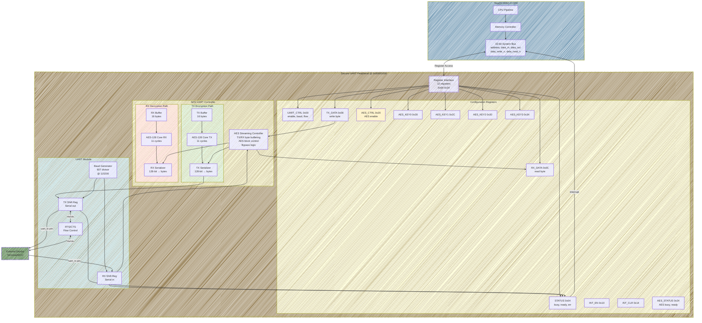
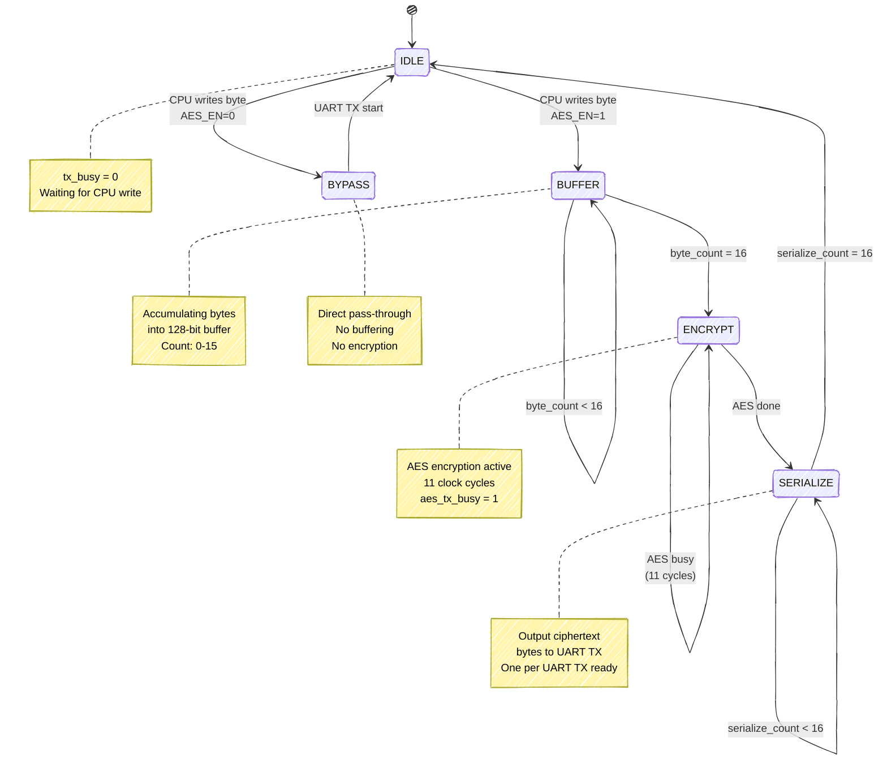
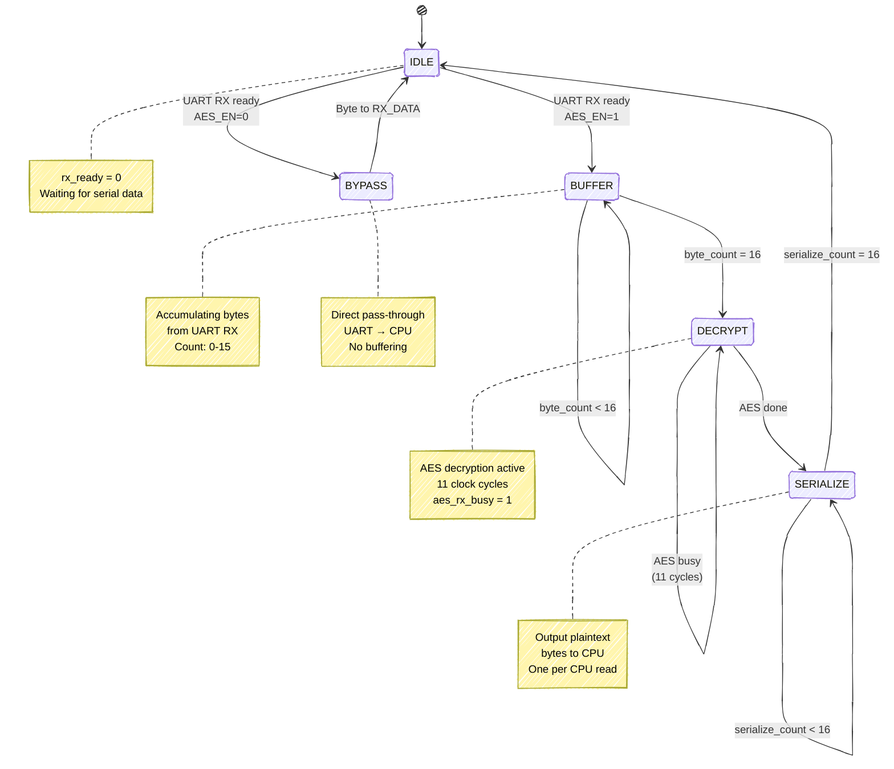
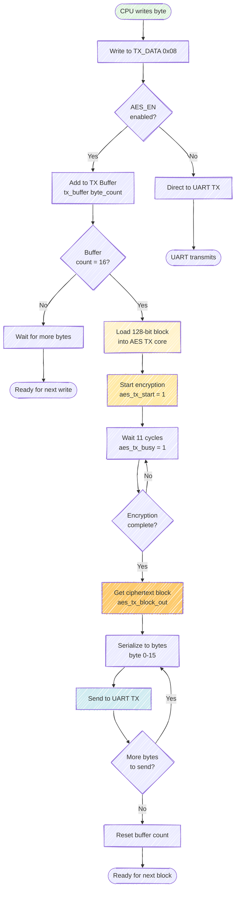
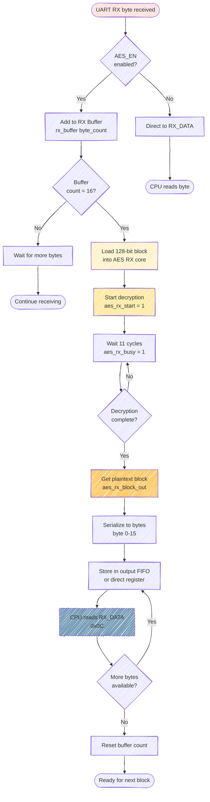
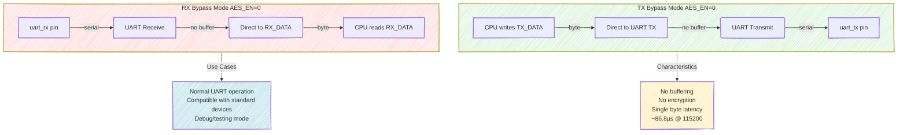
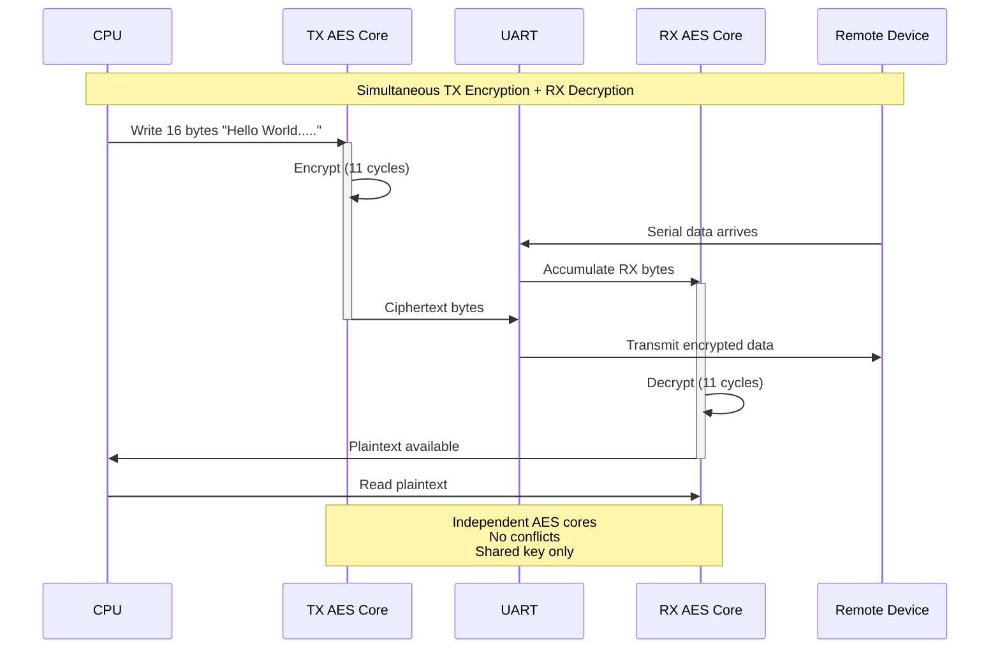
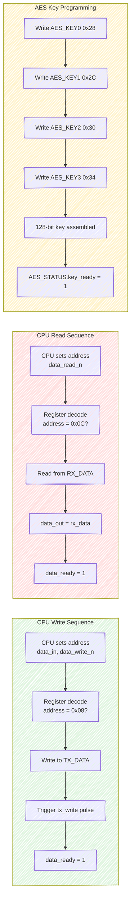
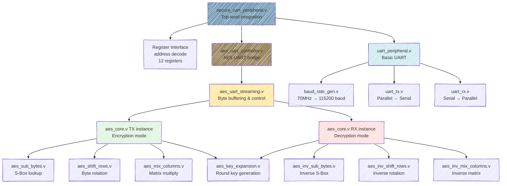

# Secure UART System - Mermaid Diagrams

Interactive visual diagrams for the Secure UART system showing architecture, data flow, and state machines using Mermaid syntax.

## Table of Contents
1. [Complete System Architecture](#1-complete-system-architecture)
2. [AES-UART Integration Flow](#2-aes-uart-integration-flow)
3. [TX Path State Machine](#3-tx-path-state-machine)
4. [RX Path State Machine](#4-rx-path-state-machine)
5. [Encryption Data Flow](#5-encryption-data-flow)
6. [Decryption Data Flow](#6-decryption-data-flow)
7. [Bypass Mode Flow](#7-bypass-mode-flow)
8. [Full-Duplex Operation](#8-full-duplex-operation)
9. [Register Access Flow](#9-register-access-flow)
10. [Module Hierarchy](#10-module-hierarchy)

---

## 1. Complete System Architecture

---

## 2. AES-UART Integration Flow

```mermaid
%%{init: {'look':'handDrawn'}}%%
graph LR
    subgraph CPU_Side["CPU Interface"]
        APP[Application Code]
        DRV[UART Driver]
        
        APP -->|uart_putc 'H'| DRV
        DRV -->|Write 0x48| TX_REG[TX_DATA<br/>0x08]
    end
    
    subgraph AES_Pipeline["AES Encryption Pipeline"]
        TX_REG -->|byte| BUF[TX Buffer<br/>Accumulate 16]
        
        BUF -->|16 bytes full| TRIG[Trigger<br/>AES Encrypt]
        
        TRIG -->|plaintext block| ENC[AES-128<br/>Encrypt<br/>11 cycles]
        
        ENC -->|ciphertext block| SER[Serialize<br/>128-bit → 16 bytes]
        
        SER -->|byte stream| UART_TX[UART TX<br/>8N1 Serial]
    end
    
    UART_TX -->|serial bits| WIRE[uart_tx pin]
    
    WIRE -->|serial bits| UART_RX[UART RX<br/>8N1 Serial]
    
    subgraph AES_RX_Pipeline["AES Decryption Pipeline"]
        UART_RX -->|byte| RX_BUF[RX Buffer<br/>Accumulate 16]
        
        RX_BUF -->|16 bytes full| RX_TRIG[Trigger<br/>AES Decrypt]
        
        RX_TRIG -->|ciphertext block| DEC[AES-128<br/>Decrypt<br/>11 cycles]
        
        DEC -->|plaintext block| RX_SER[Serialize<br/>128-bit → 16 bytes]
        
        RX_SER -->|byte stream| RX_REG[RX_DATA<br/>0x0C]
    end
    
    subgraph CPU_RX["CPU Receive"]
        RX_REG -->|Read 0x48| RX_DRV[UART Driver]
        RX_DRV -->|uart_getc| RX_APP[Application]
    end
    
    style CPU_Side fill:#7a9fb8
    style AES_Pipeline fill:#e1f5e1
    style AES_RX_Pipeline fill:#ffe1e1
    style CPU_RX fill:#7a9fb8
    style WIRE fill:#ffeaa7
```

---

## 3. TX Path State Machine

---

## 4. RX Path State Machine

---

## 5. Encryption Data Flow

---

## 6. Decryption Data Flow

---

## 7. Bypass Mode Flow

---

## 8. Full-Duplex Operation

---

## 9. Register Access Flow

---

## 10. Module Hierarchy

---

## Usage Notes

These Mermaid diagrams render in:
- **GitHub**: Automatically rendered in Markdown preview
- **VS Code**: Install "Markdown Preview Mermaid Support" extension
- **Online**: Copy to https://mermaid.live for interactive editing

All diagrams use the `handDrawn` theme for a sketch-like appearance. Remove `%%{init: {'look':'handDrawn'}}%%` for standard styling.
