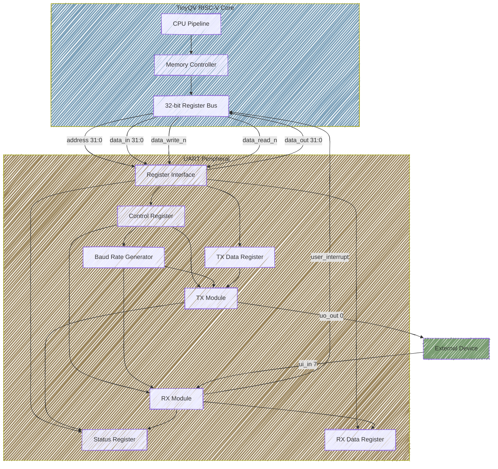
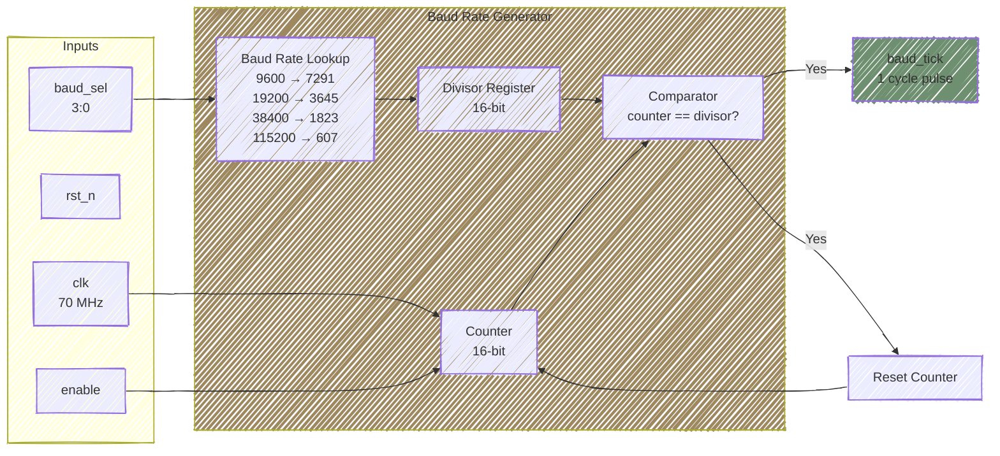
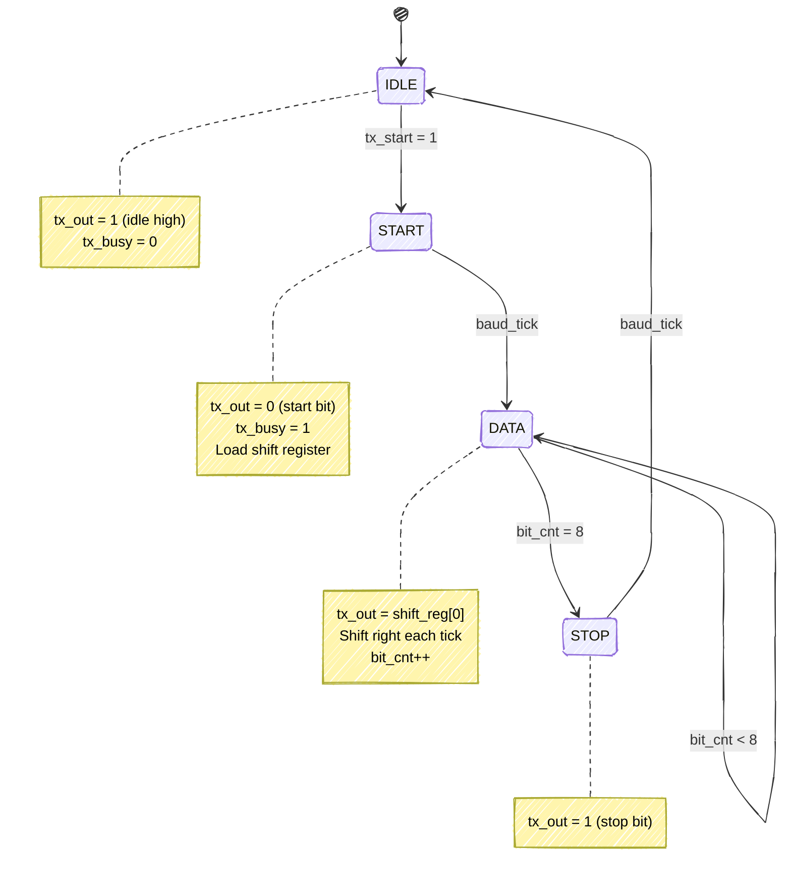
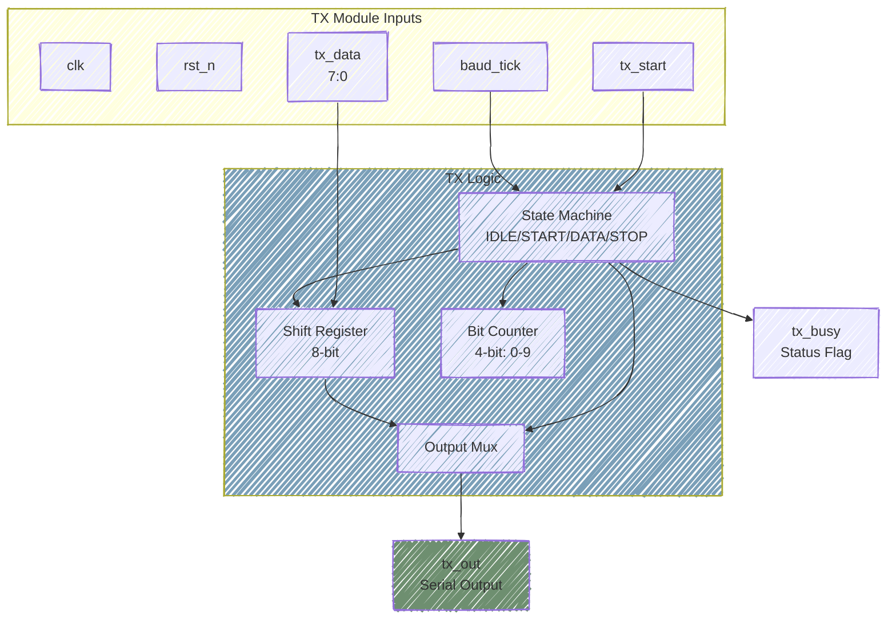
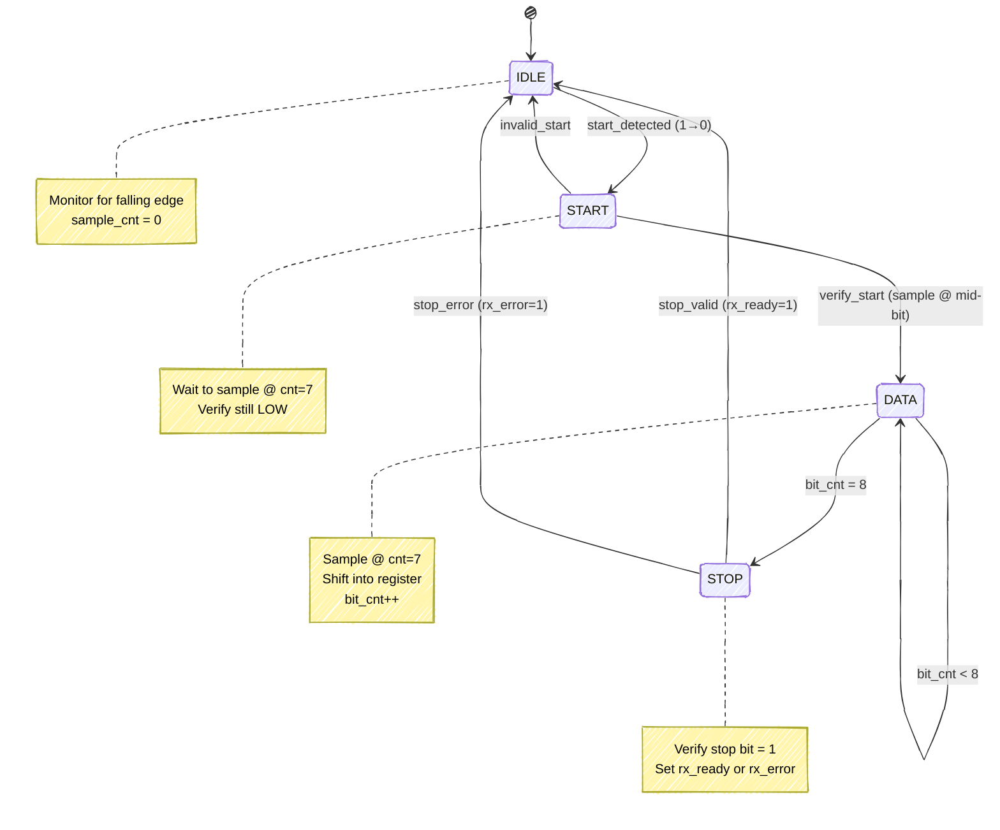
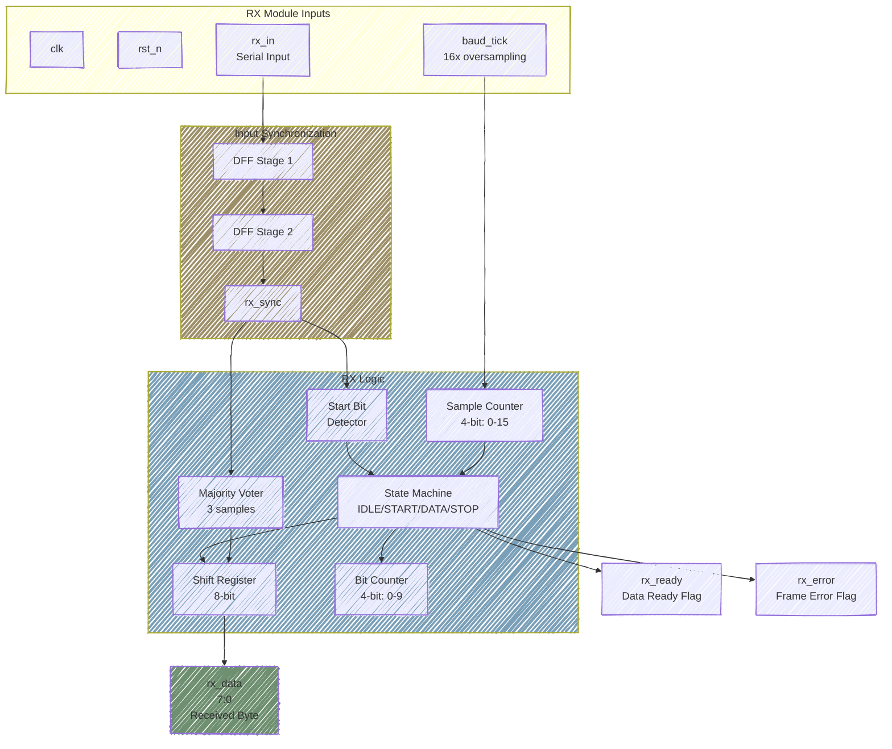
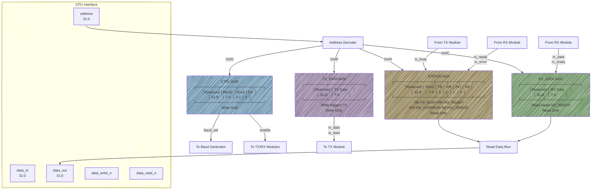
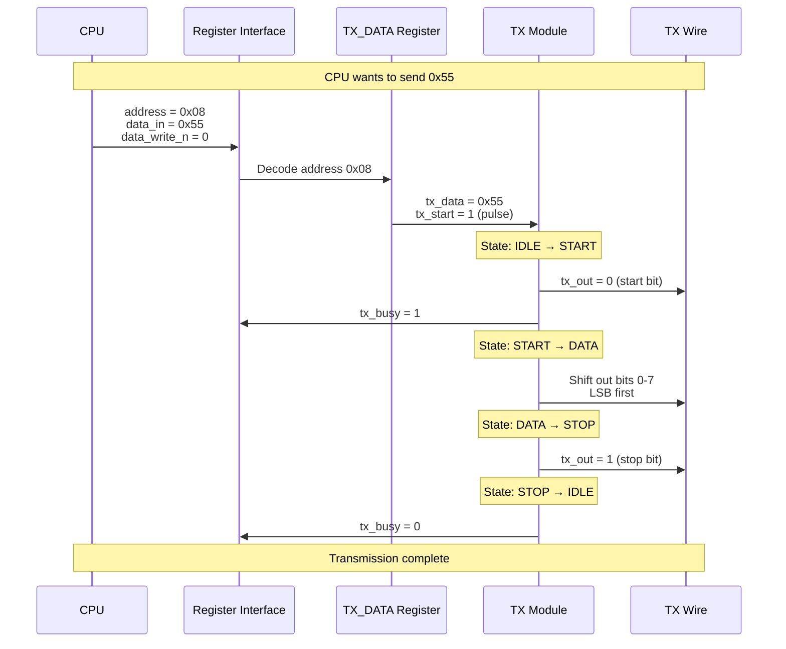
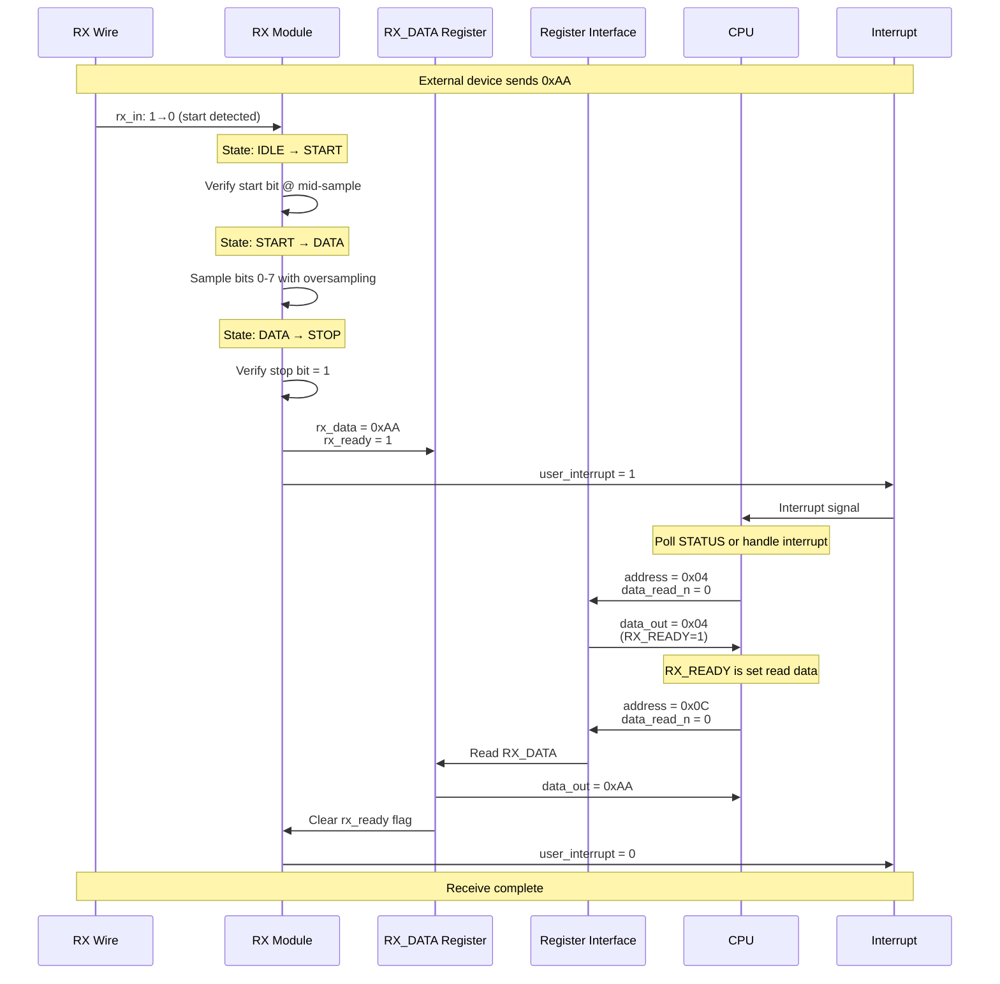

# UART Peripheral - Mermaid Diagrams

This file contains all Mermaid diagrams for the UART peripheral. These diagrams are interactive and render beautifully in GitHub and VS Code with Mermaid support.

---

## 1. Top-Level System Architecture

---

## 2. Baud Rate Generator Module

---

## 3. UART Transmitter - State Machine

---

## 4. UART Transmitter - Block Diagram

---

## 5. UART Receiver - State Machine

---

## 6. UART Receiver - Block Diagram

---

## 7. Register Interface - Memory Map

---

## 8. Transaction Sequence - Write (Send Data)

---

## 9. Transaction Sequence - Read (Receive Data)

---

## 10. Module Hierarchy

```mermaid
%%{init: {'look':'handDrawn'}}%%
graph TD
    TOP[tt_um_tqv_peripheral_harness<br/>Top-Level Wrapper]
    
    TOP --> PERIPH[tqvp_uart<br/>UART Peripheral Instance]
    TOP --> HARNESS[test_harness<br/>SPI Interface]
    
    PERIPH --> REGIF[uart_register_interface<br/>Register Decoder & Control]
    PERIPH --> BAUD[uart_baud_generator<br/>Baud Rate Timing]
    PERIPH --> TX[uart_tx<br/>Transmitter]
    PERIPH --> RX[uart_rx<br/>Receiver]
    
    REGIF --> ADDEC[address_decoder]
    REGIF --> CTRLREG[ctrl_register]
    REGIF --> STATREG[status_register]
    REGIF --> TXDREG[tx_data_register]
    REGIF --> RXDREG[rx_data_register]
    
    BAUD --> LUT[divisor_lookup]
    BAUD --> CNT[counter 15:0]
    BAUD --> TICK[tick_generator]
    
    TX --> TXFSM[tx_state_machine<br/>IDLE/START/DATA/STOP]
    TX --> TXSHIFT[shift_register 7:0]
    TX --> TXCNT[bit_counter 3:0]
    TX --> TXDRV[tx_output_driver]
    
    RX --> SYNC[input_synchronizer<br/>2 DFFs]
    RX --> SDET[start_detector]
    RX --> OSCNT[oversample_counter 3:0]
    RX --> RXFSM[rx_state_machine<br/>IDLE/START/DATA/STOP]
    RX --> RXSHIFT[shift_register 7:0]
    RX --> RXCNT[bit_counter 3:0]
    RX --> MAJ[majority_voter]
    RX --> CHECK[frame_checker]
    
    HARNESS --> SPIR[spi_reg]
    HARNESS --> REDET[rising_edge_detector]
    HARNESS --> FEDET[falling_edge_detector]
    HARNESS --> SYNC2[synchronizer]
    HARNESS --> RECLK[reclocking]
    
    style TOP fill:#7a9fb8
    style PERIPH fill:#9d8860
    style HARNESS fill:#9d8aa8
    style REGIF fill:#7a9d72
    style BAUD fill:#9d8f68
    style TX fill:#7a9fb8
    style RX fill:#b08599
```

---

## Usage Notes

1. **Viewing**: These diagrams render automatically in:
   - GitHub (native support)
   - VS Code (with Mermaid extension)
   - GitLab, BitBucket (native support)

2. **Editing**: Mermaid syntax is sensitive to:
   - Indentation (use consistent spacing)
   - Special characters (avoid in node IDs)
   - Quote marks in labels (use ` ` for line breaks)

3. **Exporting**: Can be exported to PNG/SVG using:
   - Mermaid CLI
   - Online editors (mermaid.live)
   - VS Code extensions

4. **Legend**:
   - Blue boxes: CPU/Core modules
   - Yellow boxes: UART peripheral modules
   - Green boxes: External interfaces/outputs
   - Purple boxes: Test infrastructure

---

Return to [diagrams README](README.md) for more diagram formats.
