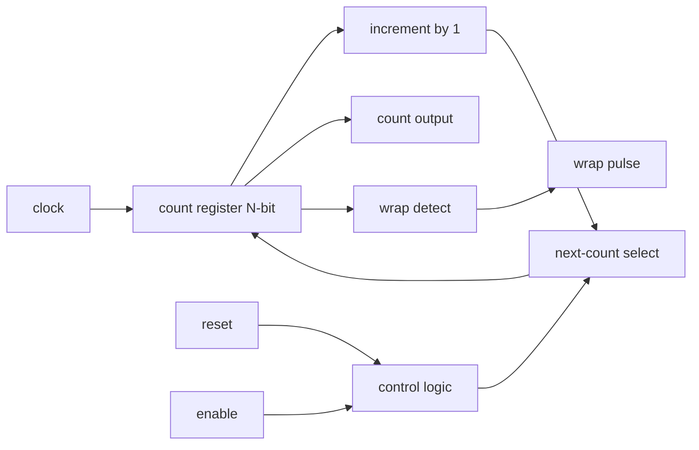

# Sprint 01 - Project A: Parameterized Counter

## 1. Objective

Design a counter block that increments once per clock cycle, supports enable and reset behavior, and can be configured for different widths (8-bit, 16-bit, 32-bit).

## 2. Why This Project Matters

- It is the smallest serious sequential design.
- It teaches time-based reasoning, not just Boolean correctness.
- It becomes the mental foundation for the Program Counter in CPU design.

## 3. Knowledge Gap Assessment (Mandatory Before Design)

Reply with confidence 1-5 for each item and one sentence of what you know.

- Clock signal and clock cycle.
- Flip-flop register behavior.
- Combinational logic versus sequential logic.
- Module, port, and signal boundaries.
- Parameterized modules.
- Counter increment and wraparound behavior.
- Finite state machine design and transition conditions.
- UART framing and baud rate timing.
- DUT and testbench roles.
- Cocotb test structure and coroutine flow.
- Assertions and when to use them.
- Coverage and why pass-fail alone is weak.
- Setup and hold timing violations.
- fMax meaning and why it is a hard limit.

## 4. Detailed Knowledge Gap Notes

### 4.1 Clock signal and clock cycle

Synchronous hardware advances in discrete time steps. The clock defines the legal moments when state may change, and cycle counting is how we reason about behavior deterministically. If your mental model is not cycle-accurate, counter logic will feel random even when the RTL is correct.

SWE analogy: event loop tick.

Plain-English note: hardware changes state on timing beats; between beats, state is held.

Project-A relevance: your counter must increment by exactly one per valid beat.

### 4.2 Flip-flop register behavior

A counter value must live in storage that survives across cycles. Flip-flops provide that storage and only accept updates at the clock edge, which prevents mid-cycle instability from propagating as state.

SWE analogy: persistent state variable that updates only at transaction commit.

Plain-English note: a register stores value safely across time and only updates on the clock edge.

Project-A relevance: the count value lives in a register.

### 4.3 Combinational logic versus sequential logic

Counter design always splits into two responsibilities: compute next count and store next count. The compute step is combinational and immediate; the store step is sequential and edge-triggered. Confusing these responsibilities causes latch-like bugs and timing ambiguity.

SWE analogy: pure function versus stateful service.

Plain-English note: combinational logic computes next value now; sequential logic stores it for later cycles.

Project-A relevance: increment math is combinational, count storage is sequential.

### 4.4 Module, port, and signal boundaries

Hardware modularity is not just style; it controls observability and verification cost. Explicit inputs and outputs let you drive and monitor behavior cleanly, while hidden coupling makes debug expensive and non-deterministic.

SWE analogy: class with API inputs and outputs.

Plain-English note: module is the block, ports are the interface pins, signals are internal wires/registers.

Project-A relevance: clear boundaries prevent hidden state and bad assumptions.

### 4.5 Parameterized modules

Parameterization decouples logic correctness from bit-width choice. Once the counter behavior is proven for generic width N, you can retarget widths without cloning files or introducing divergence bugs.

SWE analogy: generic type.

Plain-English note: one design can be reused at different widths without copy-paste.

Project-A relevance: counter width controls numeric range and wrap point.

### 4.6 Counter increment and wraparound behavior

Fixed-width arithmetic is modulo arithmetic. That means overflow is an expected transition, not an exception, and tests must treat rollover as a first-class behavior to prove correctness at boundaries.

SWE analogy: circular index rollover in a ring buffer.

Plain-English note: after max value, next increment goes to zero.

Project-A relevance: wraparound is expected behavior, not failure.

### 4.7 Finite state machine design and transition conditions

Even simple counters have control semantics: reset path, hold path, and increment path. Thinking in transition conditions now prepares you for full FSMs by forcing explicit priority and deterministic next-state selection.

SWE analogy: workflow engine with guarded transitions.

Plain-English note: FSMs move between named states based on conditions.

Project-A relevance: this project is not FSM-heavy, but enable/reset gating behaves like simple state control.

### 4.8 UART framing and baud rate timing

This topic is mostly forward-looking in Project A, but it matters because counters frequently generate timing pulses for serial protocols. If counter math is wrong, downstream protocol timing collapses even when protocol FSM logic appears correct.

SWE analogy: framed packets over a timed serial stream.

Plain-English note: UART depends on strict bit timing and frame boundaries.

Project-A relevance: limited direct use here, but counters later generate UART timing pulses.

### 4.9 DUT and testbench roles

Verification discipline starts here: isolate the design under test, drive controlled stimulus, and assert expected outcomes cycle-by-cycle. This method scales from counters to complex SoC verification.

SWE analogy: unit under test and test harness.

Plain-English note: DUT is the counter module; testbench drives inputs and checks outputs.

Project-A relevance: this is how you prove cycle-by-cycle correctness.

### 4.10 Cocotb test structure and coroutine flow

Cocotb maps naturally to synchronous reasoning because coroutines can wait on exact edges and schedule checks immediately after updates. It also enables randomized stress patterns without losing readability.

SWE analogy: async test functions with await.

Plain-English note: coroutine tests wait on clock edges, then inspect hardware signals.

Project-A relevance: perfect for deterministic cycle assertions and random enable/reset sequences.

### 4.11 Assertions and when to use them

Assertions encode non-negotiable truths and fail at the first violating cycle. They are the fastest way to detect logical drift in control conditions before waveform investigation consumes time.

SWE analogy: runtime invariants in tests.

Plain-English note: assertions fail immediately when expected behavior is violated.

Project-A relevance: assert count stability when enable is low and increment correctness when enable is high.

### 4.12 Coverage and why pass-fail alone is weak

A passing test only proves what it exercised, not what it missed. Coverage closes this blind spot by revealing whether corner cases like wrap, reset-interrupt, and hold behavior were actually hit.

SWE analogy: code coverage plus scenario coverage.

Plain-English note: one passing test can still miss critical conditions.

Project-A relevance: ensure wrap event, reset event, and hold behavior are all actually exercised.

### 4.13 Setup and hold timing violations

RTL simulation assumes ideal timing unless delays are modeled, so timing failures can hide until implementation. Setup and hold checks reveal whether physical paths satisfy edge-capture windows at target frequency.

SWE analogy: race window around commit boundary.

Plain-English note: data arriving too late or changing too early around clock edge causes capture errors.

Project-A relevance: the counter can simulate fine but fail in FPGA/ASIC timing if paths violate constraints.

### 4.14 fMax meaning and why it is a hard limit

fMax is an implementation outcome, not a code wish. It depends on logic depth, routing, and library characteristics, and it defines the practical upper bound for reliable clocking.

SWE analogy: maximum safe throughput before SLA collapse.

Plain-English note: fMax is the fastest safe clock for a design under timing constraints.

Project-A relevance: Branch A and Branch B success depends on meeting timing at target frequency.

## 5. Architecture View

### 5.1 Block Diagram (Mermaid)

### 5.2 Architecture Walkthrough (Arrow-by-Arrow)

1. clock to count register: defines when state capture occurs.
2. reset to control logic: reset path forces known safe value selection.
3. enable to control logic: decides whether to hold or increment.
4. count register to increment logic: current state feeds next-value math.
5. increment logic to next-count select: candidate incremented value.
6. control logic to next-count select: chooses hold/reset/increment behavior.
7. next-count select to count register: selected next value is captured on clock edge.
8. count register to output: external world observes current count.
9. count register to wrap detect: comparator checks for rollover condition.
10. wrap detect to wrap pulse: emits one-cycle event on rollover.

### 5.3 Data Path vs Control Path

Data path:

- count register
- increment logic
- next-count select output value

Control path:

- reset handling
- enable handling
- select control for hold/reset/increment
- wrap detection condition

### 5.4 Cycle Narrative

1. If reset is active, selected next value is zero.
2. If reset is inactive and enable is low, selected next value is current value.
3. If reset is inactive and enable is high, selected next value is current plus one.
4. At max value, plus-one result wraps to zero due to fixed width.

## 6. Threat Map (Project A)

1. Off-by-one rollover bug at max boundary.
2. Hidden count changes while enable is low.
3. Reset behavior that is ambiguous at clock edge boundaries.

## 7. Verification Checklist

- Check reset-to-zero behavior.
- Check hold behavior with enable low.
- Check increment behavior with enable high.
- Check wrap behavior at maximum value.
- Randomize enable patterns across long runs.
- Inject reset pulses during active counting.
- Add assertions for hold and increment invariants.
- Track coverage for reset, hold, increment, and wrap events.

## 8. Common Failure Modes and First Debug Signals

- Symptom: count changes while enable low.
  - First signals: enable, selected next value, count.
- Symptom: incorrect wrap point.
  - First signals: width parameter, count comparator output.
- Symptom: unstable value after reset transition.
  - First signals: reset, selected next value, clock edge alignment.

## 9. Success Criteria

- Correct cycle-by-cycle behavior for reset, hold, increment, and wrap.
- Evidence captured for both Branch A and Branch B.
- Verification includes deterministic and randomized scenarios with coverage hooks.

## 10. Stage Teaching Log (Living)

### S01 - Baseline Calibration

- Core notes taught:
  - Sprint 01 scope, branch policy, and noob-first teaching depth.
  - Why timing reasoning is mandatory before RTL writing.
- Drills and questions asked:
  - Baseline confidence confirmation for all core concepts.
- Key math and equations:
  - None at this stage.
- Student response quality:
  - Accepted baseline at confidence 1/5 and aligned with teaching flow.
- Corrections made:
  - None.
- Next checkpoint:
  - S02 timing foundations.

### S02 - Timing Foundations

- Core notes taught:
  - Cycle-accurate tracing with control inputs changing across cycles.
  - Hold-cycle semantics when enable is low.
  - Wrap intuition for fixed-width counters.
- Drills and questions asked:
  - 4-bit cycle trace with mixed enable behavior.
  - Follow-up question on general wrap-cycle shift with k hold cycles.
- Key math and equations:
  - For a hold cycle, count does not change.
  - Wrap shift intuition: each hold adds +1 cycle delay to wrap timing.
- Student response quality:
  - Initial trace missed one hold cycle.
  - Corrected after feedback and understood why wrap point moved.
- Corrections made:
  - Explicitly enforced hold behavior at enable low cycles.
  - Reinforced that wrap timing must be counted from effective increments, not raw cycle count.
- Next checkpoint:
  - S03 state-update semantics.

### S03 - State Update Semantics

- Core notes taught:
  - Synchronous reset behavior.
  - Reset priority over enable when both are asserted.
  - Three-branch state update law for reset, hold, and increment.
- Drills and questions asked:
  - N=5 mixed-control trace with resets at cycles 3 and 11.
  - Hold cycles at 5, 6, 9, and 14.
  - Requested trace focus on cycles 9 to 16.
- Key math and equations:
  - Piecewise update law:
    - reset active -> next count is 0
    - reset inactive and enable low -> hold current count
    - reset inactive and enable high -> increment modulo 2^N
- Student response quality:
  - Correctly traced cycles 9 to 16 after correction pass.
  - Demonstrated understanding of reset priority and hold behavior.
- Corrections made:
  - Tightened distinction between raw cycles and increment-effective cycles.
  - Corrected wrap-cycle claim that ignored hold-delay effects.
- Next checkpoint:
  - S04 boundary and rollover semantics.

### S04 - Boundary and Rollover Semantics (Done)

- Core notes taught so far:
  - Segment-based wrap analysis after the last reset.
  - Boundary behavior at max value and modulo rollover event.
- Drills and questions asked:
  - Rewrite the wrap rule in one line using symbols N, R, and H.
  - State the exact condition that invalidates the rule.
- Key math and equations:
  - Candidate rule under segment assumptions:
    - t_wrap = R + 2^N + H
  - Valid only if no new reset occurs between R and the predicted wrap cycle.
- Student response quality:
  - Correct intuition about hold-based delay.
  - Accepted the interval correction from (R, t_wrap) to (R, t_wrap] and understood why reset priority matters at boundary cycles.
- Corrections completed:
  - Keep N strictly as bit-width symbol.
  - Distinguish reset-cycle marker R from reset count/index symbols.
  - Phrase invalidity condition as: any additional reset before predicted wrap resets the segment and invalidates current estimate.
- Next checkpoint:
  - Transition to S05 architecture decomposition.

### S05 - Architecture Decomposition (Done)

- Core notes taught so far:
  - Stage scope confirmed: block-level partition and arrow-by-arrow meaning.
  - Data path vs control path decomposition is the primary objective.
- Drills and questions asked:
  - Kickoff prompt for S05 progression accepted.
  - Arrow classification drill for 10 architecture arrows using labels DP, CP, and OBS.
  - Follow-up question: if OBS path breaks, what fails first?
- Key math and equations:
  - No new equations yet; focus moves from boundary math to structural interpretation.
- Student response quality:
  - Ready to proceed and explicitly requested S05.
  - First classification attempt was strong: 8/10 arrows correctly categorized.
  - Final submission provided failure symptoms for all 10 arrows with mostly accurate signal-level impact.
- Corrections in progress:
  - None pending for classification.
- Corrections completed:
  - Reclassified arrow 5 as DP (increment candidate data path into selector).
  - Reclassified arrow 9 as OBS in this module context.
  - Refined OBS failure framing: impact includes debug visibility and can include external functional breakage if outputs are contract-critical.
  - Clarified arrow 9 symptom wording: false or missing wrap-detect indication rather than generic overflow claim.
- Next checkpoint:
  - Transition to S06 manual trace drills.

### S06 - Manual Trace Drills (Done)

- Core notes taught so far:
  - Stage transition from structural decomposition to execution and fault localization.
  - Manual traces must now include “which path likely failed” diagnosis.
- Drills and questions asked:
  - Mixed-control 8-cycle trace issued with forced root-cause choice between arrow 3 and arrow 6.
  - Follow-up clarification requested by student on "each hypothesis" phrasing; interpreted as competing root-cause hypotheses (arrow 3 vs arrow 6).
  - Probe-separation micro-drill answered: if arrow 6 is guilty at cycle 3, source-select should be HOLD while destination-select appears as INCREMENT.
  - Integrated 6-cycle drill answered correctly: first mismatch identified at C2 with arrow 6 as primary suspect due to source/destination divergence.
- Key math and equations:
  - Reuse S03 update law and S04 segment wrap rule during debug trace analysis.
- Student response quality:
  - Attempted full-cycle prediction and selected arrow 3 as likely culprit.
  - Primary misses were modulo wrap and hold propagation, which shifted mismatch localization.
  - Second attempt improved conceptual framing and correctly questioned reset polarity assumptions.
  - Probe choice (enable and reset) was directionally useful but not sufficiently discriminative for arrow 3 vs arrow 6 isolation.
  - Final micro-drill response was correct and concise: source=HOLD, destination=INCREMENT, observed wrong increment.
  - Integrated drill response was correct: mismatch cycle and culprit were both localized without ambiguity.
- Corrections in progress:
  - None outstanding for S06.
- Corrections completed:
  - Correct expected sequence fixed to: 15, 0, 0, 0, 1, 1, 2, 3.
  - Correct mismatch localization: cycle 3 in first mixed-control drill and cycle 2 in integrated drill.
  - Probe strategy validated: source/destination control-select separation across arrow 6.
  - Reset convention reaffirmed: active-high reset (rst=1 asserted, rst=0 deasserted).
- Next checkpoint:
  - Transition to S07 verification strategy design.

### S07 - Verification Strategy (Done)

- Core notes taught so far:
  - Verification strategy must be specified before implementation to prevent "write RTL then guess tests" behavior.
  - A valid strategy for Project A needs deterministic scenarios, invariants, and measurable coverage goals.
- Drills and questions asked:
  - S07 kickoff pending first scenario-matrix submission.
  - Student asked whether S07 means writing full testbenches before RTL (TDD concern) and raised readiness concern for SV/UVM.
  - Student asked roadmap-level verification questions: when testbench coding starts, where UVM begins, whether UVM replaces Cocotb, and whether SOP step 2 should be reframed.
  - Student reported low confidence on S07 terminology (scenario, verification matrix, stimulus pattern, invariant, coverage bin).
  - Student asked whether verification matrix is the same as vPlan.
  - Student submitted S07-G0 definitions and answered concrete stimulus trace follow-up (initial count 14 under reset-first pattern).
  - Student submitted first full S07 pack draft including scenario list, three invariants, four coverage-bin names, and a rationale question on why 6 scenarios were requested.
  - Student submitted revised S07 pack with edge-precise invariants, explicit bin hit conditions, and an explicit wrap-shift scenario intent.
  - Student submitted a further S07 revision and explicitly corrected wrap-shift target from C17 to C19.
  - Student submitted final normalized matrix draft and resolved remaining structural concerns.
- Key math and equations:
  - Reuse update law from S03 and rollover rule from S04 as assertion intent sources.
- Student response quality:
  - Proactively challenged process ordering and tool readiness, which is strong systems-thinking behavior.
  - S07-G0 response quality is strong: all five term definitions are functionally correct and coherent.
  - Concrete follow-up trace was correct: after C1 to C5, count sequence converges to 0, 1, 2, 2, 3 due to reset dominance at C1.
  - First full S07 draft shows good structural understanding and includes valid high-value scenarios (reset dominance, reset priority, hold/increment behavior, wrap).
  - Student asked whether 6 scenarios is arbitrary and proposed additional scenario on wrap-shift under k holds, which is an excellent advanced verification thought.
  - Revised submission shows clear improvement: invariants and coverage bins are now technically aligned with edge semantics.
  - Final submission quality is acceptance-level for Sprint 1: scenario coverage and probe strategy are now coherent and implementation-ready.
- Corrections in progress:
  - Clarified S07 scope: test intent and verification plan first, not full UVM coding.
  - Clarified tooling: S07 artifacts can be plain-English and Python-oriented; UVM is not required at this checkpoint.
  - Clarified roadmap timing: UVM starts as mandatory practice at Sprint 5 Project B (Bus Interconnect verification), while Cocotb remains primary verification method in earlier sprints.
  - Clarified recommendation: do not replace SOP verify step; refine it to a two-layer policy (Cocotb default across projects, UVM mandatory on selected ASIC-complex protocol projects).
  - Curriculum contract now made explicit: S07 = Wave 1 intent artifacts, S08 = Wave 2 executable Cocotb checks plus RTL structure.
  - Added glossary rows for S07 terminology and switched to an S07-G0 term-ownership mini-check before full matrix submission.
  - Clarified hierarchy: verification matrix is one structured component inside a broader vPlan document.
  - Made stimulus-pattern definition concrete with a cycle-by-cycle Project-A input script example.
  - S07-G0 term-ownership checkpoint is now closed.
  - None outstanding for S07.
- Corrections completed:
  - Increment and hold objectives are now non-duplicate and trace different failure modes.
  - Wrap-shift row explicitly states C17 to C19 expectation and preserves external-first probe ordering.
  - Editorial normalization applied: increment row expected-count label aligned to provided stimulus depth.
- Next checkpoint:
  - Transition to S08 RTL structure and executable check mapping.

### S08 - RTL Structure and Executable Checks (Active)

- Core notes taught so far:
  - Wave 2 starts after S07 intent is stable: implement RTL structure and immediately map tests back to S07 scenarios.
  - Execution order: RTL skeleton first, then Cocotb smoke checks, then directed and randomized checks.
- Drills and questions asked:
  - S08 kickoff pending first RTL structure decomposition and check-mapping plan.
  - Student requested no-jargon clarification of "RTL structure map" and "test intent" before attempting decomposition.
  - Student asked what the expected S08 deliverable should look like (block descriptions vs pseudocode vs code) and requested an example response format.
  - Student submitted S08-G0 and first S08-A package: three-block RTL structure decomposition plus six scenario-to-intent mappings.
  - Student submitted corrected hold intent line and proposed randomized wrap-shift intent statement.
  - Student asked for clarification of "checker hooks" in S08-B mapping request.
  - Student asked for exact meaning of "pass condition" in test mapping context.
  - Student submitted S08-B table: scenario to suite mapping with checker hooks and pass conditions, including randomized augmentation row.
  - Student submitted S08-B cleanup with explicit randomized suite label and provided first S08-C row draft for reset-priority checker flow.
  - Student questioned whether current precision layer feels overly nitpicky.
  - Student submitted refined reset-priority S08-C row with explicit edge-sample point, post-edge check, and triage-style fail text.
  - Student submitted representative S08-C rows and requested to avoid repetitive full-table typing; checkpoint evaluated as pattern-mastery evidence.
  - Student explicitly requested to stop redundant S08-D granularity and move to implementation/execution kickoff.
  - Student stated low confidence in SystemVerilog and beginner-level Verilog familiarity, plus limited direct Cocotb authoring experience.
- Key math and equations:
  - Preserve S03 edge update law and S04 wrap condition as executable checker truths.
- Student response quality:
  - Requested clarification early rather than guessing, which is correct process behavior.
  - Reported confidence breakthrough: S07 matrix made implementation start-point clear, and S08 block mapping improved mental model for structuring hardware code.
  - Submission quality is strong: block responsibilities and inter-block signal flow are mostly correct and implementation-ready.
  - Student raised valid concern on smoke vs directed boundary, indicating healthy verification taxonomy awareness.
  - Correction turnaround was fast and accurate; typo on hold condition was fixed cleanly.
  - Randomized-intent wording is directionally correct and demonstrates segment-level reasoning under variable holds and resets.
  - S08-B submission is strong and execution-oriented; checks are mostly edge-precise and aligned with S07 intent.
  - S08-C draft shows correct structure (sample point, comparison rule, fail message skeleton) and readiness for final precision pass.
  - Reset-priority S08-C refinement is accepted; separation between input sampling and output validation is now explicit.
  - Representative-row follow-up confirms stable understanding; student can generalize checker-flow format without further repetitive prompting.
  - Student push to move from planning to build phase is justified at this point.
  - Student also flagged realistic implementation readiness risk, which is correct self-assessment and should be handled before writing RTL.
- Corrections in progress:
  - Added glossary definitions for RTL structure map, test intent, smoke test, directed test, and randomized test.
  - S08 checkpoint narrowed to terminology ownership before decomposition.
  - Clarify S08 expected output format explicitly: structured design note plus test-intent mapping, not full RTL code at this checkpoint.
  - Hold intent correction completed: rst=0 and en=0 for hold behavior.
  - Randomized intent normalized to verification-grade wording: randomized en/rst sequences across multiple reset segments and hold counts while checking invariants and wrap-shift consistency per segment.
  - Randomized row normalization completed: suite type explicitly labeled.
  - Reset-priority row precision objective completed.
  - S08-C pattern objective completed via representative-row mastery.
  - S08-D repetitive expansion waived by mastery evidence and student request.
  - Minor text normalization applied conceptually: ensure fail-message inputs match scenario inputs (avoid rst/en mismatch in message text).
  - Clarified checker-hook meaning and added glossary entry for consistent terminology use in upcoming S08-B submission.
  - Clarified pass-condition meaning and added glossary entry for S08-B check-table consistency.
  - Added S08-L0 readiness gate: short micro-learning block for SV syntax/semantics and Cocotb checker authoring basics before implementation kickoff.
  - Added glossary rows for implementation-critical beginner terms: always_ff, always_comb, nonblocking assignment (`<=`), and Cocotb RisingEdge.
- Next checkpoint:
  - S08-L0 readiness checkpoint: demonstrate basic ownership of SV module skeleton, always_ff/always_comb split, and Cocotb edge-driven check pattern in own words.

## 11. Self-Check Questions

1. Why is increment logic alone not enough without a register?
2. Which exact signal controls whether count changes this cycle?
3. Why can a design pass simulation and still fail timing at higher frequency?
