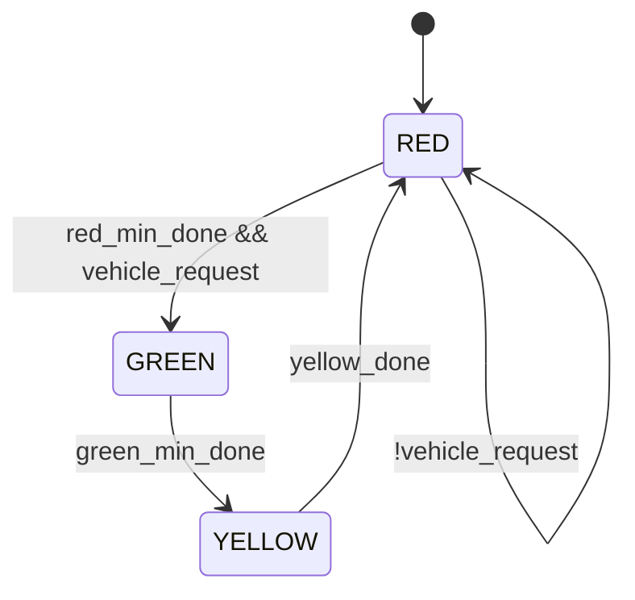

# Sprint 01 - Project B: Traffic Light Controller FSM

## 1. Objective

Design a deterministic finite state machine (FSM) that controls Red, Green, and Yellow lights based on timing conditions and traffic sensor input.

## 2. Why This Project Matters

- This is your first control-path-dominant hardware design.
- It trains you to think in states, guards, and cycle-accurate transitions.
- It maps directly to later protocol engines, arbiters, and bus controllers.

## 3. Knowledge Gap Assessment (Mandatory Before Design)

Reply with confidence 1-5 for each item and one sentence of what you know.

- Clock signal and clock cycle.
- Flip-flop register behavior.
- Combinational logic versus sequential logic.
- Module, port, and signal boundaries.
- Parameterized modules.
- Counter increment and wraparound behavior.
- Finite state machine design and transition conditions.
- UART framing and baud rate timing.
- DUT and testbench roles.
- Cocotb test structure and coroutine flow.
- Assertions and when to use them.
- Coverage and why pass-fail alone is weak.
- Setup and hold timing violations.
- fMax meaning and why it is a hard limit.

## 4. Detailed Knowledge Gap Notes

### 4.1 Clock signal and clock cycle

FSM correctness is defined at sampled instants, not continuously. Transition guards are evaluated relative to cycle boundaries, so understanding exactly when signals are observed is fundamental to deterministic behavior.

SWE analogy: scheduler tick in an event-driven service.

Plain-English note: state changes happen at clock edges, not continuously.

Project-B relevance: state transitions must occur only at valid cycle boundaries.

### 4.2 Flip-flop register behavior

The FSM state register is the system memory of “where we are now.” Without reliable edge-triggered storage, output decode and transition logic lose coherence and can oscillate or misfire.

SWE analogy: transaction commit to persistent in-memory state.

Plain-English note: the current FSM state is stored in a register and stays stable between edges.

Project-B relevance: without a state register, the controller cannot remember whether it is in RED, GREEN, or YELLOW.

### 4.3 Combinational logic versus sequential logic

Good FSM structure cleanly separates next-state decision logic from state update logic. This separation is crucial for timing closure, simulation clarity, and avoiding combinational loops.

SWE analogy: pure next-step function versus stored runtime state.

Plain-English note: combinational logic computes next state; sequential logic stores that state.

Project-B relevance: split next-state logic from state-update logic to avoid unstable behavior.

### 4.4 Module, port, and signal boundaries

If sensor inputs, timer-done signals, and outputs are not explicitly bounded at the module interface, debugging becomes guesswork. Precise interfaces also allow targeted property checks and cleaner reuse.

SWE analogy: API contract for a service.

Plain-English note: inputs (sensor, timers, reset) and outputs (lights) must be explicit and observable.

Project-B relevance: clear boundaries make verification and debug deterministic.

### 4.5 Parameterized modules

Traffic policies vary by application, so phase durations should be configurable without editing RTL internals. Parameterized timing values preserve design intent while enabling reuse.

SWE analogy: configurable service constants loaded at startup.

Plain-English note: the same FSM can support different minimum RED/GREEN/YELLOW durations by parameter changes.

Project-B relevance: parameterization avoids rewriting RTL when traffic timing requirements change.

### 4.6 Counter increment and wraparound behavior

Timer counters act as temporal guards for state transitions. Incorrect increment bounds or done thresholds create latent bugs that only appear under long-run or edge timing scenarios.

SWE analogy: countdown timer that triggers a state advance event.

Plain-English note: timer counters track how long a light has been active and assert done signals at thresholds.

Project-B relevance: incorrect counter threshold logic causes premature or delayed transitions.

### 4.7 Finite state machine design and transition conditions

The core design risk is ambiguous guard logic. If multiple transitions are possible in one cycle without explicit priority, behavior may differ between simulation and synthesis outcomes.

SWE analogy: workflow engine with strict guard checks.

Plain-English note: every transition needs a clear condition and priority rule.

Project-B relevance: ambiguous guards can produce illegal or unpredictable light sequencing.

### 4.8 UART framing and baud rate timing

This is cross-project context, but useful: both traffic FSMs and UART controllers rely on strict temporal contracts. The same discipline of guard precision and cycle alignment applies.

SWE analogy: protocol framing contract in network messaging.

Plain-English note: while UART is a different project, both systems fail when timing contracts are loosely defined.

Project-B relevance: this mindset reinforces strict transition timing discipline in FSM control.

### 4.9 DUT and testbench roles

A robust testbench should orchestrate realistic input sequences and verify both functional outcomes and safety properties. Separation of stimulus and checks keeps failures diagnosable.

SWE analogy: production component and integration test harness.

Plain-English note: DUT is the traffic-light FSM; the testbench applies sensor/timer scenarios and checks outputs.

Project-B relevance: explicit stimulus plus checks is how you prove legal transition behavior.

### 4.10 Cocotb test structure and coroutine flow

Coroutines let you model asynchronous external events while still making synchronous edge-based checks. This makes it easier to test corner cases like sensor glitches and reset interruptions.

SWE analogy: async tests that await heartbeat ticks.

Plain-English note: coroutines can drive sensor changes at specific cycles and verify state/output at each edge.

Project-B relevance: ideal for cycle-by-cycle transition checks.

### 4.11 Assertions and when to use them

Assertions are ideal for safety constraints that must never be violated. For control systems, they detect illegal output combinations immediately and reduce debug latency.

SWE analogy: runtime invariant checks in CI tests.

Plain-English note: assertions fail immediately when forbidden behavior appears.

Project-B relevance: assert mutually exclusive light outputs and legal state encoding at all times.

### 4.12 Coverage and why pass-fail alone is weak

A single green-path simulation can hide major transition holes. Coverage provides proof that every intended state and transition was exercised and observed.

SWE analogy: endpoint tests passed but key branches never exercised.

Plain-English note: one passing traffic sequence can hide missing transition cases.

Project-B relevance: you need state coverage and transition coverage, not just one demo scenario.

### 4.13 Setup and hold timing violations

Transition logic can be functionally right and physically late. Timing analysis confirms whether guard evaluation and state capture meet real edge windows at target frequency.

SWE analogy: race window around a commit boundary.

Plain-English note: transition-path signals arriving too late or changing too early around the edge can corrupt state capture.

Project-B relevance: FSM may look correct in basic simulation but fail timing on implementation.

### 4.14 fMax meaning and why it is a hard limit

fMax captures the slowest legal path in the design implementation. In FSM-heavy logic, compare trees and decode depth often dominate this limit.

SWE analogy: maximum safe throughput before request latency collapse.

Plain-English note: fMax is the highest clock where all timing paths still meet constraints.

Project-B relevance: transition logic depth and timer compare paths usually define your critical limit.

## 5. Architecture View

### 5.1 State Diagram (Mermaid)

### 5.2 Architecture Walkthrough (Arrow-by-Arrow)

1. [*] to RED: reset or power-up entry to known safe state.
2. RED to GREEN: leave RED only when minimum red duration is met and demand exists.
3. RED to RED: stay RED when there is no vehicle demand.
4. GREEN to YELLOW: transition once minimum GREEN duration is satisfied.
5. YELLOW to RED: transition after YELLOW duration completes.

### 5.3 Block-Level Interpretation

- State register stores current phase.
- Next-state logic evaluates guards using state plus timer/sensor inputs.
- Timer block tracks phase duration and emits done signals.
- Output decode maps state to light outputs.

### 5.4 Data Path vs Control Path

Data path:

- timer count values
- threshold comparators

Control path:

- state register
- transition guard logic
- output decode logic

### 5.5 Timing Interpretation Notes

- Guard conditions are sampled synchronously with clock edges.
- Sensor events near an edge can change which transition is selected.
- Transition logic depth impacts fMax and timing closure margin.

## 6. Threat Map (Project B)

1. Ambiguous transition priority causing non-deterministic behavior.
2. Timer-done generation errors causing skipped or stretched phases.
3. Output decode bugs causing illegal simultaneous light assertions.

## 7. Verification Checklist

- Verify each legal transition only occurs under its guard.
- Verify illegal transitions never occur.
- Verify output safety: never assert conflicting lights together.
- Randomize sensor pulse timing and duration.
- Inject reset in each state and verify deterministic recovery to RED.
- Add assertions for legal state set and output mutual exclusion.
- Track state coverage and transition coverage.

## 8. Common Failure Modes and First Debug Signals

- Symptom: stuck in RED forever.
  - First signals: vehicle_request, red_min_done, transition select.
- Symptom: skipped YELLOW.
  - First signals: green_min_done, state register, next-state decode.
- Symptom: two lights active together.
  - First signals: state decode outputs and state encoding.

## 9. Success Criteria

- Deterministic and explainable transition behavior under all tested scenarios.
- Safety assertions hold throughout simulation.
- Coverage confirms all states and legal transitions were exercised.
- Branch A evidence captured (timing reports with no setup/hold violations).
- Branch B evidence captured (clean OpenLane run with no DRC errors).

## 10. Self-Check Questions

1. If two guards evaluate true in the same cycle, what exact logic guarantees one winner?
2. Which output invariant must always hold, regardless of state or input noise?
3. What is the current critical path in your transition logic, and why?
