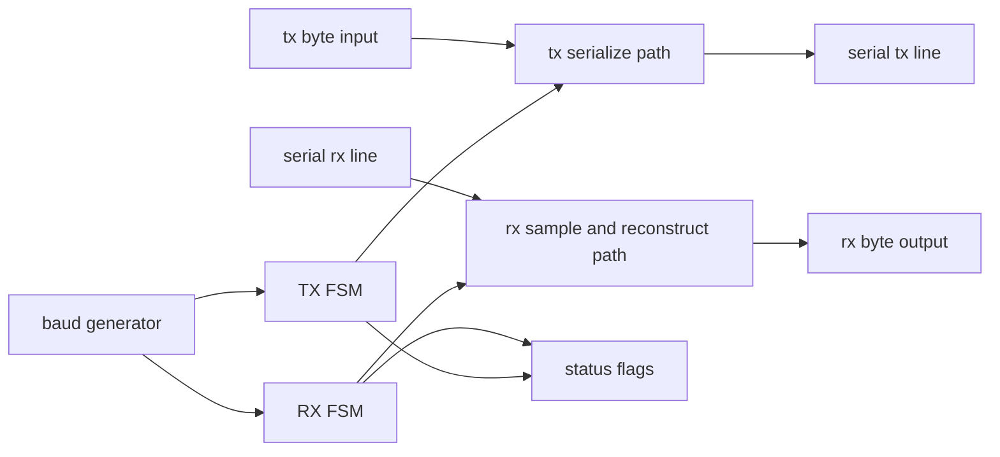

# Sprint 01 - Project C: UART Core (Tx/Rx)

## 1. Objective

Design and verify a UART transmitter and receiver that communicate reliably at configured baud rates using standard frame structure.

## 2. Why This Project Matters

- It combines state machines, counters, and timing discipline in one practical protocol.
- It is your first protocol verification system with real failure modes.
- It becomes a recurring integration interface in later sprints.

## 3. Knowledge Gap Assessment (Mandatory Before Design)

Reply with confidence 1-5 for each item and one sentence of what you know.

- Clock signal and clock cycle.
- Flip-flop register behavior.
- Combinational logic versus sequential logic.
- Module, port, and signal boundaries.
- Parameterized modules.
- Counter increment and wraparound behavior.
- Finite state machine design and transition conditions.
- UART framing and baud rate timing.
- DUT and testbench roles.
- Cocotb test structure and coroutine flow.
- Assertions and when to use them.
- Coverage and why pass-fail alone is weak.
- Setup and hold timing violations.
- fMax meaning and why it is a hard limit.

## 4. Detailed Knowledge Gap Notes

### 4.1 Clock signal and clock cycle

UART control is governed by system clock edges, but protocol symbols evolve at a derived baud cadence. You must reason in both domains at once: internal cycle timing and external bit timing.

SWE analogy: heartbeat tick in a streaming service loop.

Plain-English note: internal UART state updates on clock edges, while bit timing is derived from counters.

Project-C relevance: TX and RX phase changes are only valid at the intended timing events.

### 4.2 Flip-flop register behavior

TX/RX phase, shift buffers, and status flags all rely on stable register updates. Any register misuse or edge ambiguity can manifest as sporadic framing or data errors that are hard to localize.

SWE analogy: committed state in a finite workflow engine.

Plain-English note: TX state, RX state, shift data, and status bits are all stored in registers.

Project-C relevance: corrupted register updates directly produce corrupted serial behavior.

### 4.3 Combinational logic versus sequential logic

UART correctness depends on strict sequencing: compute next outputs and transitions combinationally, then commit them sequentially. Mixing these creates race-like behavior in frame progression and status signaling.

SWE analogy: compute next event versus persist next event.

Plain-English note: combinational logic computes next bit or state; sequential logic stores it per cycle.

Project-C relevance: mixing these domains incorrectly causes unstable frame progression.

### 4.4 Module, port, and signal boundaries

UART interfaces must clearly define ownership of TX/RX lines, control writes, and status reads. Ambiguous boundaries cause integration bugs long before functional logic is exhausted.

SWE analogy: network service contract and internal implementation.

Plain-English note: TX line, RX line, clock/reset, and status/control ports must be explicit and unambiguous.

Project-C relevance: clean interfaces make testbench stimulus and scoreboard checks reliable.

### 4.5 Parameterized modules

Protocol cores survive reuse only if timing constants are configurable. Parameterizing divisors and frame options allows one core to target different deployment clocks and throughput constraints.

SWE analogy: configurable runtime constants for protocol stacks.

Plain-English note: baud divisor and frame options should be configurable without rewriting core logic.

Project-C relevance: parameterization lets one UART core target different system clocks and baud rates.

### 4.6 Counter increment and wraparound behavior

Baud timing is quantized by counters, so divisor arithmetic accuracy is non-negotiable. Off-by-one behavior accumulates phase error across bits and can convert valid frames into noise.

SWE analogy: periodic scheduler counter with threshold trigger.

Plain-English note: baud generation uses counters; one off-by-one bug changes sample timing.

Project-C relevance: timing drift from divisor errors causes byte corruption across longer frames.

### 4.7 Finite state machine design and transition conditions

UART TX and RX are independent FSMs with strict phase contracts. Each state transition must correspond to a clear protocol event or timing checkpoint.

SWE analogy: send/receive protocol phases in a strict state machine.

Plain-English note: TX and RX must transition through frame phases deterministically.

Project-C relevance: invalid state progression can produce malformed start/data/stop behavior.

### 4.8 UART framing and baud rate timing

This is the central technical risk in UART. Start-bit lock, bit-center sampling, and stop-bit validation must remain aligned under realistic clock/divisor mismatch and jitter conditions.

SWE analogy: framed packet protocol with strict symbol timing.

Plain-English note: start bit alignment, bit-center sampling, and stop-bit validity determine whether bytes decode correctly.

Project-C relevance: this is the central risk area for UART correctness.

### 4.9 DUT and testbench roles

The DUT should be treated as a black-box protocol endpoint while the testbench acts as a hostile peer. Strong benches inject non-ideal timing and malformed cases, not just nominal bytes.

SWE analogy: service binary under test and protocol test harness.

Plain-English note: DUT is UART core; testbench drives serial stimuli and checks reconstructed data and flags.

Project-C relevance: no waveform intuition is trustworthy until verified by automated checks.

### 4.10 Cocotb test structure and coroutine flow

Cocotb’s concurrency model is valuable for UART because TX drive, RX observation, and scoreboard comparison can run in parallel with precise edge alignment.

SWE analogy: async integration tests with concurrent producers/consumers.

Plain-English note: coroutines naturally model bit-time waits and simultaneous TX/RX activity.

Project-C relevance: enables realistic traffic tests and timing-aware assertions.

### 4.11 Assertions and when to use them

Assertions encode protocol invariants such as legal state sequences and flag consistency. They catch violations immediately at the source cycle rather than later in reconstructed payload mismatches.

SWE analogy: runtime invariants in tests.

Plain-English note: assertions fail immediately when expected behavior is violated.

Project-C relevance: assert legal state progression, flag behavior, and protocol timing assumptions.

### 4.12 Coverage and why pass-fail alone is weak

UART has many subtle edge cases: pattern sensitivity, burst spacing, and error signaling behavior. Coverage makes sure the verification scope includes these dimensions rather than a narrow happy path.

SWE analogy: green test run with missing branch coverage.

Plain-English note: passing one or two happy paths does not prove robustness.

Project-C relevance: need coverage for edge byte patterns, back-to-back frames, and error states.

### 4.13 Setup and hold timing violations

Receive sampling paths and control enables can violate edge windows at implementation frequency. Timing closure confirms that protocol logic still behaves under physical delays and routing realities.

SWE analogy: race at commit boundary under high load.

Plain-English note: a path can violate timing around clock edge capture even when RTL simulation looks clean.

Project-C relevance: receive sampling and baud control paths are sensitive timing hotspots.

### 4.14 fMax meaning and why it is a hard limit

fMax expresses the implementation’s timing ceiling, not the RTL author’s intent. If your required clock exceeds fMax, UART behavior is undefined regardless of simulation pass rate.

SWE analogy: max safe request rate before deterministic behavior collapses.

Plain-English note: fMax is the highest reliable clock after implementation timing analysis.

Project-C relevance: tighter timing margins directly impact UART reliability under real hardware constraints.

## 5. Architecture View

### 5.1 UART Core Diagram (Mermaid)

### 5.2 Architecture Walkthrough (Arrow-by-Arrow)

1. Baud generator to TX FSM: controls when TX advances frame phase.
2. Baud generator to RX FSM: controls sample cadence and phase progression.
3. TX byte input to TX serialize path: parallel data enters serializer.
4. TX FSM to TX serialize path: chooses start, data, or stop bit drive behavior.
5. TX serialize path to TX line: emits serial bitstream to external receiver.
6. RX line to sample-and-reconstruct path: captures incoming serial signal.
7. RX FSM to sample-and-reconstruct path: aligns sample timing and controls byte assembly.
8. Reconstruct path to RX byte output: publishes decoded byte when frame is complete.
9. TX/RX FSMs to status flags: report busy, ready, and error conditions.

### 5.3 Block-Level Interpretation

- Baud generator creates timing pulses from system clock.
- TX path serializes bytes based on TX state machine.
- RX path samples, validates, and reconstructs bytes based on RX state machine.
- Status logic surfaces protocol and readiness signals to software/testbench.

### 5.4 Data Path vs Control Path

Data path:

- TX serializer bit movement
- RX sampled-bit reconstruction
- byte output staging

Control path:

- TX/RX state machine sequencing
- baud event gating
- status and error flag generation

### 5.5 Timing Interpretation Notes

- Start-bit detection anchors RX phase alignment.
- Mid-bit sampling improves robustness against edge uncertainty.
- Small baud mismatch accumulates across frame bits and can break stop-bit validation.

## 6. Threat Map (Project C)

1. Sample phase misalignment causing shifted or corrupted bytes.
2. Divisor mistakes causing systematic baud drift.
3. Verification limited to ideal traffic, missing error-path behavior.

## 7. Verification Checklist

- Test fixed patterns: 0x00, 0xFF, 0x55, 0xAA.
- Test randomized byte streams and randomized inter-frame gaps.
- Test back-to-back frames under sustained activity.
- Test reset during TX and RX activity.
- Test framing error scenarios.
- Add assertions for legal state progression and status behavior.
- Track coverage for TX states, RX states, and error/status combinations.

## 8. Common Failure Modes and First Debug Signals

- Symptom: one-bit data shift.
  - First signals: start detect event, sample phase counter, RX state.
- Symptom: sporadic corruption at higher rates.
  - First signals: baud divisor, sample-point alignment, state transition timing.
- Symptom: dropped frames.
  - First signals: ready/busy flags, receive-complete handshake, error flags.

## 9. Success Criteria

- Reliable TX/RX behavior across deterministic and randomized tests.
- Error-path behavior tested and visible in coverage.
- Branch A evidence captured (timing reports with no setup/hold violations).
- Branch B evidence captured (clean OpenLane flow and no DRC errors).

## 10. Self-Check Questions

1. Why is UART fundamentally a timing problem as much as a logic problem?
2. Which control signal chain determines exactly when RX samples each bit?
3. How would you bound baud error so frame decode remains reliable?
