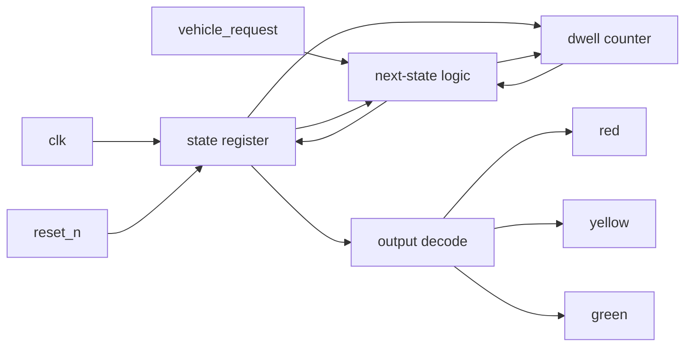

# Design Specification

## Project

Traffic Light Controller FSM.

## Objective

Build a synthesizable traffic light controller for a single intersection. The controller shall keep one of three legal phases active at a time, enforce a minimum dwell time for each phase, and advance only when the dwell timer and vehicle request rules allow it. Reset shall return the controller to a known safe state immediately.

## Parameter Contract

| Parameter           | Type             | Required Constraint                                                         | Default | Purpose                                                                               |
| ------------------- | ---------------- | --------------------------------------------------------------------------- | ------- | ------------------------------------------------------------------------------------- |
| `RED_MIN_CYCLES`    | positive integer | `>= 1`                                                                      | `3`     | Minimum time the controller must remain in RED before leaving it.                     |
| `GREEN_MIN_CYCLES`  | positive integer | `>= 1`                                                                      | `5`     | Minimum time the controller must remain in GREEN before leaving it.                   |
| `YELLOW_MIN_CYCLES` | positive integer | `>= 1`                                                                      | `2`     | Minimum time the controller must remain in YELLOW before leaving it.                  |
| `COUNT_WIDTH`       | positive integer | Must be wide enough to represent the largest configured minimum cycle count | `4`     | Internal dwell counter width. The implementation may derive a larger value if needed. |

## Functional Requirements

| ID   | Requirement                                                                                                       | Clarification                                                       |
| ---- | ----------------------------------------------------------------------------------------------------------------- | ------------------------------------------------------------------- |
| FR1  | The design shall expose a clock input.                                                                            | `clk` is the only state update clock.                               |
| FR2  | The design shall expose an asynchronous active-low reset input.                                                   | `reset_n` forces the controller back to RED immediately.            |
| FR3  | The design shall expose a vehicle request input.                                                                  | `vehicle_request` indicates demand for service at the intersection. |
| FR4  | The design shall expose RED, YELLOW, and GREEN outputs.                                                           | Only one phase shall be active at a time.                           |
| FR5  | The design shall support configurable minimum dwell times for each phase.                                         | RED, GREEN, and YELLOW each have their own minimum cycle count.     |
| FR6  | The design shall remain in RED until RED dwell has expired and vehicle request is present.                        | Vehicle demand does not override the dwell rule.                    |
| FR7  | The design shall advance from RED to GREEN only when both RED dwell and vehicle request conditions are satisfied. | This is the only legal RED exit path.                               |
| FR8  | The design shall remain in GREEN until GREEN dwell has expired.                                                   | `vehicle_request` shall not interrupt GREEN.                        |
| FR9  | The design shall advance from GREEN to YELLOW only when GREEN dwell is satisfied.                                 | GREEN has exactly one legal exit path.                              |
| FR10 | The design shall remain in YELLOW until YELLOW dwell has expired.                                                 | `vehicle_request` shall not interrupt YELLOW.                       |
| FR11 | The design shall advance from YELLOW to RED only when YELLOW dwell is satisfied.                                  | YELLOW has exactly one legal exit path.                             |
| FR12 | The design shall reset to RED with all dwell counters cleared.                                                    | Reset dominates all state and timer behavior.                       |
| FR13 | The design shall maintain output mutual exclusion.                                                                | Red, yellow, and green shall never be asserted together.            |
| FR14 | The design shall not skip phases.                                                                                 | The only legal sequence is RED -> GREEN -> YELLOW -> RED.           |
| FR15 | The design shall sample inputs synchronously on the rising edge of `clk`.                                         | No mid-cycle input change shall directly alter the outputs.         |

## Interface

| Signal            | Direction | Description                                |
| ----------------- | --------- | ------------------------------------------ |
| `clk`             | input     | Sampling clock for all registered state.   |
| `reset_n`         | input     | Asynchronous active-low reset.             |
| `vehicle_request` | input     | Demand input from the intersection sensor. |
| `red`             | output    | Active-high RED lamp command.              |
| `yellow`          | output    | Active-high YELLOW lamp command.           |
| `green`           | output    | Active-high GREEN lamp command.            |

## Timing and Behavior

- Reset is asynchronous and dominates both the state register and the dwell counter.
- The controller changes state only on the rising edge of `clk` when reset is deasserted.
- `vehicle_request` is sampled on the rising edge and only affects RED exit logic.
- In RED, the controller shall hold until the minimum RED dwell has elapsed and a request is present.
- In GREEN, the controller shall hold until the minimum GREEN dwell has elapsed.
- In YELLOW, the controller shall hold until the minimum YELLOW dwell has elapsed.
- Output decode shall be a pure function of the current state so outputs are stable between clock edges.
- The dwell counter shall reset on state entry so each phase measures its own minimum occupancy cleanly.
- Edge cases include minimum dwell parameters set to 1, reset asserted while `vehicle_request` is high, and repeated request toggling while the controller is not in RED.

## Architecture View

### Block Diagram

### Arrow-by-Arrow Walkthrough

1. `clk` to state register: defines the only legal sampling moment for state updates.
2. `reset_n` to state register: immediately clears the machine to RED-safe behavior.
3. `vehicle_request` to next-state logic: provides the demand condition used only when RED can legally exit.
4. state register to next-state logic: gives the current phase context used for transition selection.
5. state register to dwell counter: identifies which phase the timer should measure.
6. dwell counter to next-state logic: tells the FSM whether the current phase has satisfied its minimum dwell.
7. state register to output decode: converts internal state into visible light commands.
8. output decode to red/yellow/green: drives exactly one lamp command high at a time.
9. next-state logic to state register: captures the selected next phase on the clock edge.
10. next-state logic to dwell counter: clears or advances the dwell measurement when a new phase begins.

### Architecture Interpretation Notes

- The state register is the control memory of the controller. If this register is wrong, the whole intersection is wrong.
- The dwell counter is a guard rail, not a feature. It prevents a phase from ending too early.
- Next-state logic must decide both legality and priority. If two exits are possible, RED demand gating wins before phase progression, and reset wins before everything else.
- Output decode should not contain transition logic. If it starts deciding state, debug becomes much harder and timing gets worse.

## Non-Goals

- No pedestrian crossing logic.
- No emergency vehicle preemption.
- No flashing-yellow or flashing-red maintenance mode.
- No sensor debounce block inside the controller.
- No CDC logic or multi-clock domain handling.
- No bus interface or software-visible register map.
- No physical lamp driver circuitry.

## Implementation Notes

- Use an enumerated state type for RED, GREEN, and YELLOW.
- Keep state update logic and output decode logic separate.
- Derive the dwell counter width so the configured dwell parameters are representable.
- Keep the controller synthesizable and avoid latches or combinational feedback loops.
- If a future version adds sensor synchronization or emergency overrides, that should be a separate documented change rather than a hidden modification.

## Acceptance Criteria

- Reset returns the controller to RED immediately.
- RED cannot exit before the RED dwell is satisfied.
- RED can exit only when a vehicle request is present and the dwell is satisfied.
- GREEN advances only after GREEN dwell completion.
- YELLOW advances only after YELLOW dwell completion.
- The controller never asserts more than one lamp output at once.
- The controller never skips a phase.
- The outputs remain stable between clock edges except when reset is asserted.
- The design compiles cleanly in simulation and is structurally ready for synthesis and implementation flow.

## Traceability

| Requirement | Verification Intent                                           |
| ----------- | ------------------------------------------------------------- |
| FR1         | Clocked harness and interface compile check.                  |
| FR2         | Reset recovery tests from every state.                        |
| FR3         | Demand-gating tests in RED plus randomized request sequences. |
| FR4         | Output decode checks and mutual exclusion assertions.         |
| FR5         | Parameter-boundary tests for minimum dwell values.            |
| FR6         | RED hold scenario.                                            |
| FR7         | RED-to-GREEN transition scenario.                             |
| FR8         | GREEN hold scenario with request toggling.                    |
| FR9         | GREEN-to-YELLOW transition scenario.                          |
| FR10        | YELLOW hold scenario with request toggling.                   |
| FR11        | YELLOW-to-RED transition scenario.                            |
| FR12        | Reset-in-every-state scenario.                                |
| FR13        | Output invariant assertions across all scenarios.             |
| FR14        | Transition-sequence coverage checks.                          |
| FR15        | Edge-aligned checker hooks and randomized timing stress.      |

## Verification Coupling

This specification is verified by `docs/verification-plan.md`. The verification plan shall treat the transition order, dwell rules, and output exclusivity as contract items rather than as informal expectations.
